# AllData® Next-Gen Widgets Integration Guide
November 2021

 

## Appendix A

### Harvesting Alert Error Resolution Screens

#### Error 100

**Currently unable to update accounts at this institution**

We are actively working on this issue. When this issue has been resolved, your accounts will be automatically updated. We apologize for the inconvenience.

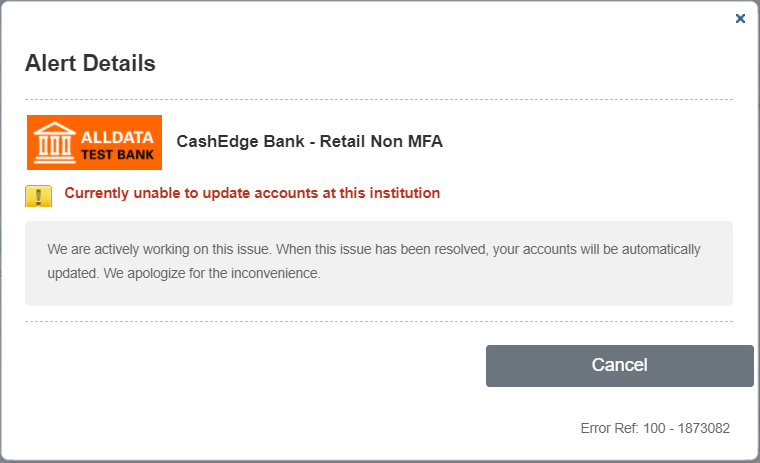

**Information alert:** Fiserv will resolve the issue. After it is resolved, refreshing the account will clear the error.

#### Error 103

**Currently unable to access accounts at this institution**

There were problems with this institution&#39;s website when we last attempted to update your account. When this issue is resolved at _institution name_, your accounts will be automatically updated. We apologize for the inconvenience.

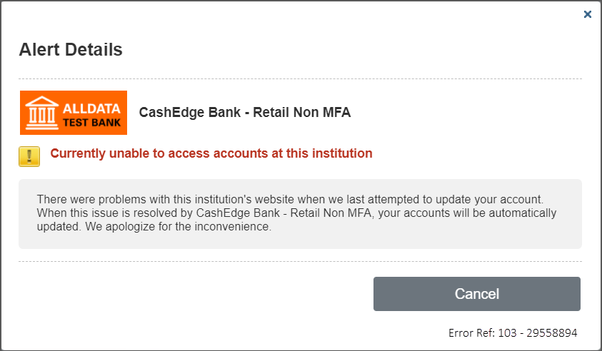

**Information alert:** Issue with FI website

#### Error 104

**Currently unable to access accounts at this institution**

There were problems with this institution&#39;s website when we last attempted to update your account. When this issue is resolved by **institution name** , your accounts will be automatically updated. We apologize for the inconvenience.

**Information alert:** Issue with FI website

#### Error 105

**Currently unable to access accounts at this institution**

There were problems with this institution&#39;s website when we last attempted to update your account. When this issue is resolved by _institution name_, your accounts will be automatically updated. We apologize for the inconvenience.

**Information alert:** Issue with FI website

#### Error 106

**Currently unable to access accounts at this institution**

There were problems with this institution&#39;s website when we last attempted to update your account. When this issue is resolved by _institution name_, your accounts will be automatically updated. We apologize for the inconvenience.

**Information alert:** Issue with FI website

#### Error 107

**Currently unable to access accounts at this institution**

There were problems with this institution&#39;s website when we last attempted to update your account. When this issue is resolved by _institution name_, your accounts will be automatically updated. We apologize for the inconvenience.

**Information alert:** Issue with FI website

#### Error 108

**Currently unable to access accounts at this institution**

There were problems with this institution&#39;s website when we last attempted to update your account. When this issue is resolved by _institution name_, your accounts will be automatically updated. We apologize for the inconvenience.

**Information alert:** Issue with FI website

#### Error 109

**Currently unable to update accounts at this institution**

We are actively working on this issue. When this issue has been resolved, your accounts will be automatically updated. We apologize for the inconvenience.

**Information alert:** This type of alert remains on the user interface until it is resolved by Fiserv and the account is refreshed.

#### Error 110

This may be a closed or inactive account that has not been deleted from the institution&#39;s website.

1. If this account has not been closed or inactivated, contact customer support.
2. If this account has been closed or inactivated, remove it from your profile.
3. If you do not know whether or not this account has been closed or inactivated, login to the _institution name_ website and check the account status.

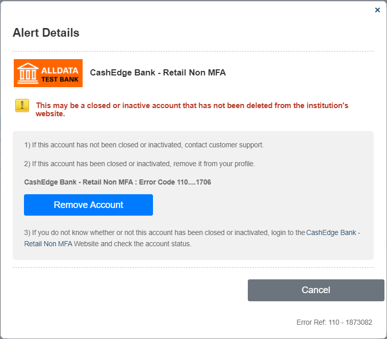

**User intervention required:** Clicking **Remove Account** resolves the alert by initiating the process to delete the account from the user&#39;s profile. If this is the only account associated with the credentials at the FI for the user, then the entire FI is deleted from the user&#39;s profile.

#### Error 121

**Currently unable to update accounts at this institution**

We are actively working on this issue. When this issue has been resolved, your accounts will be automatically updated. We apologize for the inconvenience.

**Information alert:** This type of alert will remain on the user interface until Fiserv resolves the issue and the account is refreshed.

#### Error 200

**Currently unable to update accounts at this institution**

We are actively working on this issue. When this issue has been resolved, your accounts will be automatically updated. We apologize for the inconvenience.

**Information alert:** Fiserv will resolve the issue. After it is resolved, refreshing the account will clear the error.

#### Error 201

The name or number for this account may have changed or this account may no longer be available.

Login to the _institution name_ website and check for the following:

1. If the name or number for this account has changed, click the &quot;Match Accounts&quot; button to select the correct account from a list of available accounts.
2. If this is a closed or inactive account, remove it from your profile.
3. If the name or number for this account has not changed and this is not a closed or inactive account, contact customer support.

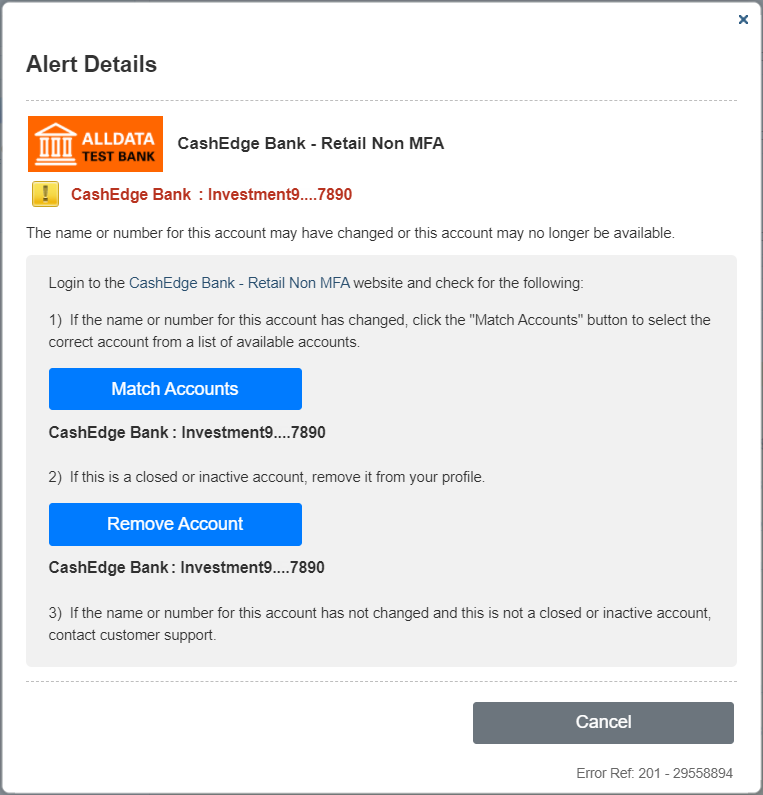

**User intervention required** – There are two options to resolve the 201 alert:

- Clicking **Remove Account** resolves the alert by initiating the process to delete the account from the user&#39;s profile. IfthisaccountistheonlyaccountassociatedwiththecredentialsattheFIforthe user, then theentireFI isdeleted from the user&#39;s profile.
- Clicking **Match Accounts** resolves the alert by initiating the process to retrieve additional accounts using the credentials for the FI. A progress indicator appears ontheoverlayscreen while the process retrieves accounts.

**Error 201 – Match Accounts progress screen**

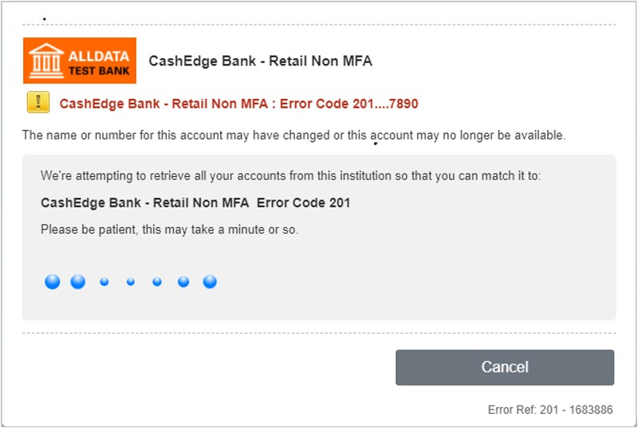

The retrieved accounts appear for the user to choose from:

**Error 201 – Accounts Match Up List**

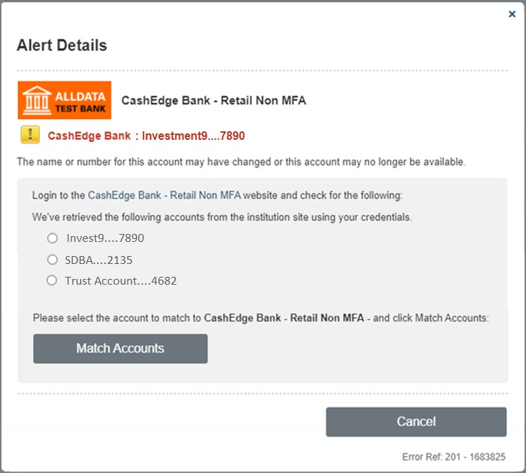

Clicking **Match Accounts** updates the existing account with the selected account&#39;s identifier (NickNameAtFI, NickNameAtCE, account number, and Misc fields).

If the match process does not find any new accounts, the following message appears to notify the user and the Resolve Alert box includes the option to delete the account from the user&#39;s profile.

**Error 201 – No new accounts identified during Match Up process**

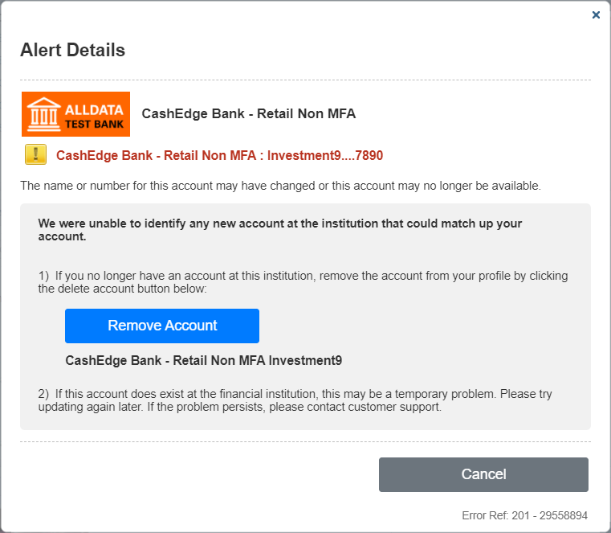

#### Error 202

**Currently unable to update accounts at this institution**

We are actively working on this issue. When this issue has been resolved, your accounts will be automatically updated. We apologize for the inconvenience.

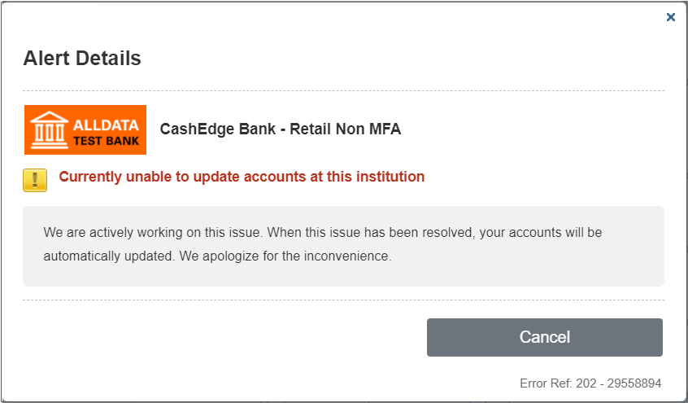

**User intervention required:** This type of alert will remain on the user interface until Fiserv resolves the issue and the account is refreshed.

#### Error 203

**Successful login but this account may no longer be available**

Login to the _institution name_ website and check for the following:

1. If this account is no longer available, remove it from your profile.
2. If this account is available, contact customer support.

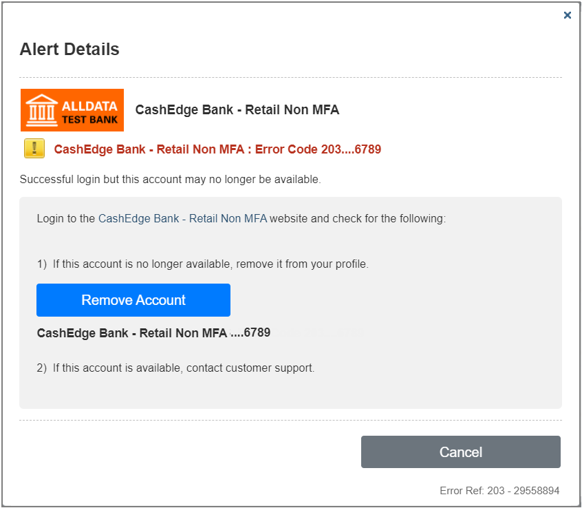

**User intervention required:** Clicking **Remove Account** resolves the alert by initiating the process to delete the institution from the user&#39;s profile. If this account is the only account associated with the credentials at the FI for the user, then the entire FI is deleted from the user profile.

#### Error 204

**Successful login but this account may no longer be available**

Login to the _institution name_ website and check for the following:

1. If this account is no longer available, remove it from your profile.
2. If this account is available, contact customer support.

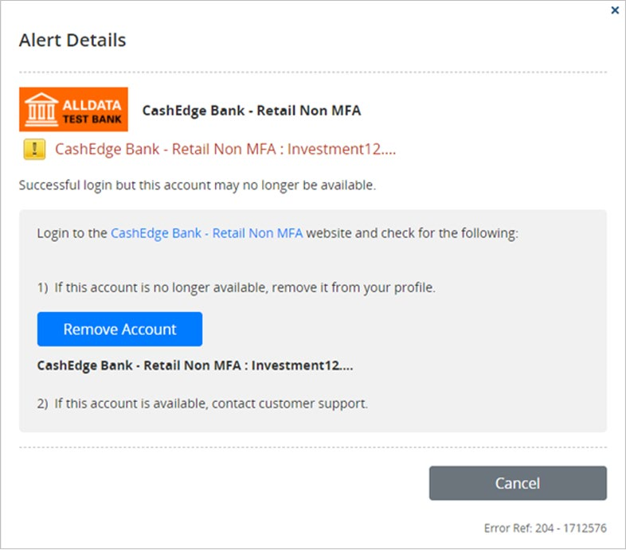

**User intervention required:** Clicking **Remove Account** resolves the alert by initiating the process to delete the account from the user&#39;s profile. If this account is the only account associated with the credentials at the FI for the user, then the entire FI is deleted from the user profile.

#### Error 205

**Currently unable to update accounts at this institution**

We are actively working on this issue. When this issue has been resolved, your accounts will be automatically updated. We apologize for the inconvenience.

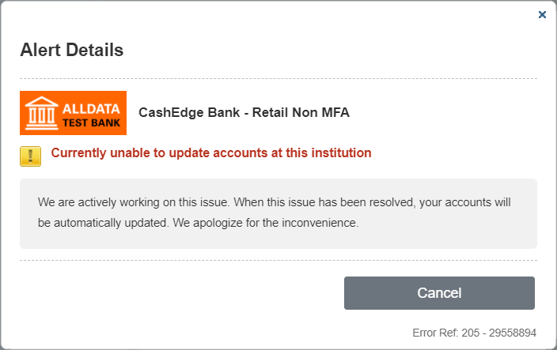

**Information alert:** Fiserv will resolve the issue. After it is resolved, refreshing the account will clear the error.

#### Error 208

**This account could not be automatically assigned to an account type.**

1. Select the account type that best describes this account.
2. If you do not know which account type to select, contact customer support.

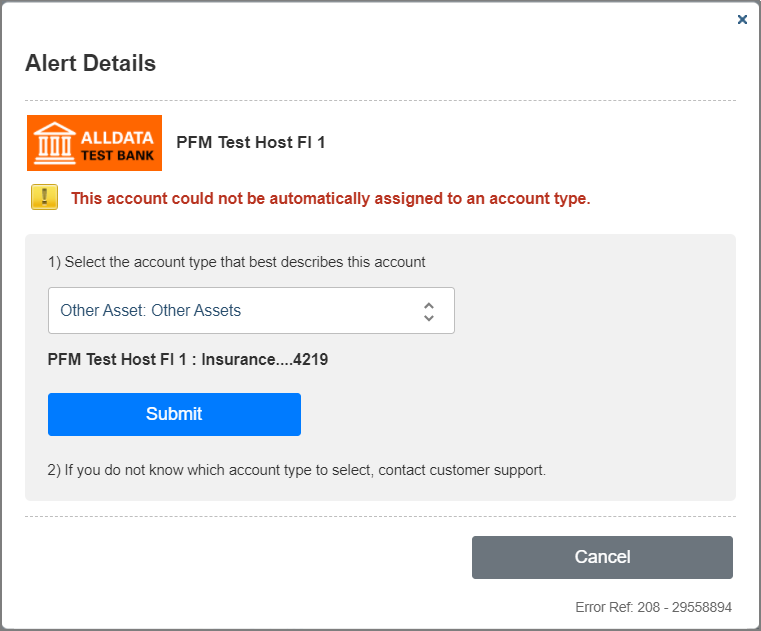

**User intervention required:** Clicking **Submit** saves the selected account type for the account, closes the overlay screen, and initiates an account update.

#### Error 209

**This account may be incorrectly classified. (For example, if an investment account is incorrectly classified as a checking account, it will fail to update.)**

1. Select the account type that best describes this account.
2. If you do not know which account type to select, contact customer support.

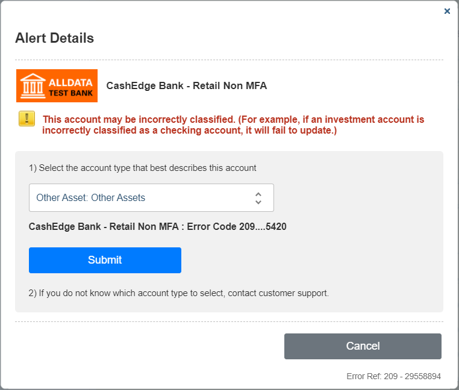

**User intervention required:** Clicking **Submit** saves the selected account type, closes the overlay screen, and initiates an account update.

#### Error 300

**The login credentials for this institution&#39;s website may be incorrect.**

Login to the _institution name_ website and check for the following:

1. If you are able to login, re-enter the same credentials below.
2. If you are unable to login, contact customer support directly at _institution name_.

**User intervention required:** Clicking **Submit** validates and saves the credentials for the FI, then closes the overlay screen and initiates an account update.

#### Error 301

**The login credentials for this institution&#39;s website may be incorrect.**

Login to the _institution name_ website and check for the following:

1. If you are able to login, re-enter the same credentials below.
2. If you are unable to login, contact customer support directly at _institution name_.

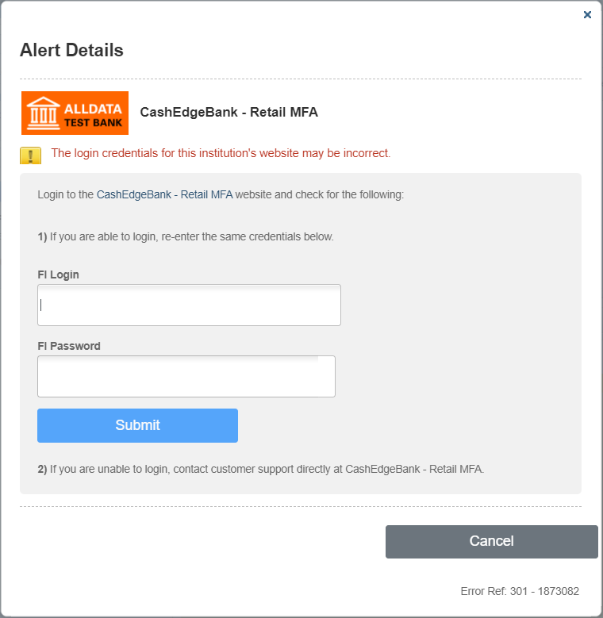

**User intervention required:** Clicking **Submit** saves the credentials for the FI, closes the overlay screen, and initiates an account update.

#### Error 302

**This institution requires additional action on an intermediate page (such as an updated agreement or additional 30questions) in order to complete the login.**

1. Login to the _institution name_ website and follow any additional instructions.
2. Click on the &quot;Update Accounts&quot; button to update all accounts at this institution.
3. If your accounts still do not update, contact customer support.

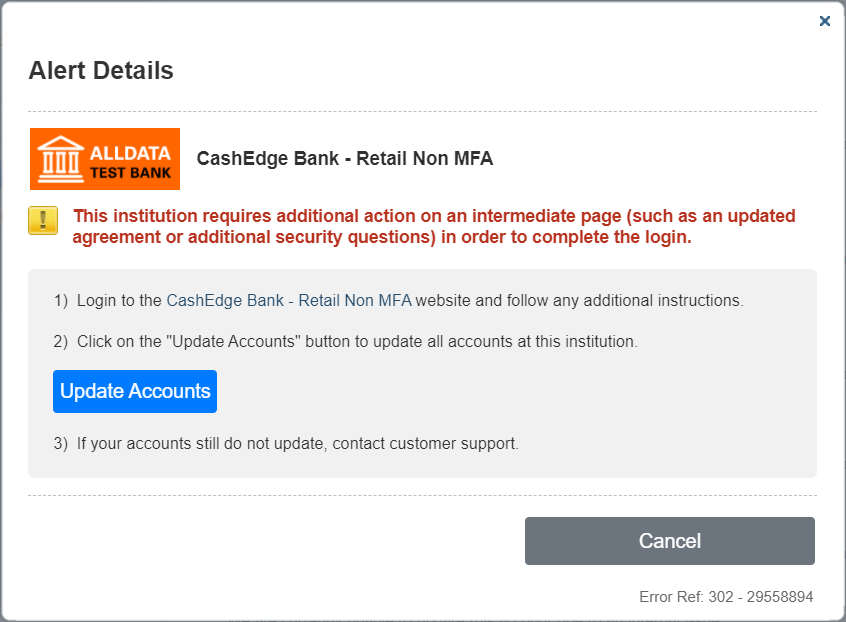

**User intervention required:** Clicking **Update Accounts** closes the overlay screen and initiates an account update.

#### Error 303

**Additional security question(s) are required by this institution&#39;s website in order to complete the login. You may be prompted to answer multiple questions or to answer the same question more than once.**

&lt;additional security question with input field&gt;

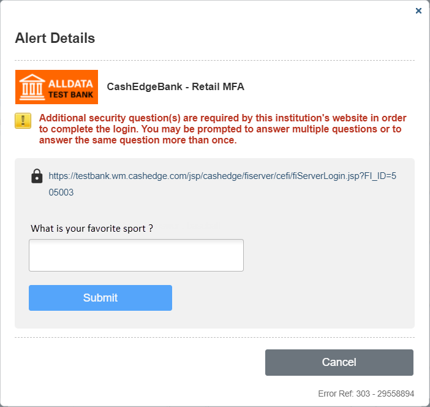

**User intervention required:** Clicking **Submit** saves the responses to the MFA challenge question(s) and initiates an account update.

#### Error 304

**One or more of your responses to this institution&#39;s security questions may be incorrect.**

Click the button below to try answering the security questions again.

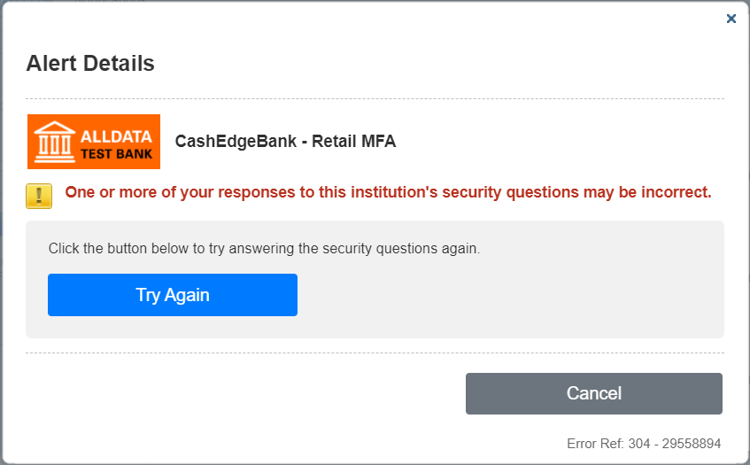

**User intervention required:** Clicking **Try Again** allows the user to give new answers to the MFA challenge questions. If valid, the new responses are saved, the overlay screen closes, and the account is updated.

#### Error 306

**This may be the wrong institution website for this account.**

Login to the _institution name_ website and check for the following:

1. If you are unable to login, this may be an incorrect website. Select the correct website by clicking the button below. This will also delete any partial accounts that may have been created for this incorrect website.
2. If you think this is the correct website, contact customer support.

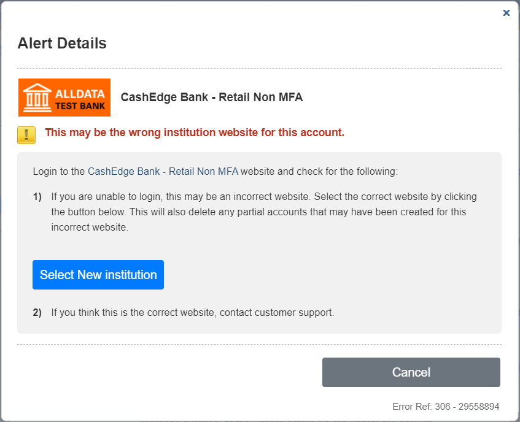

**User intervention required:** Clicking **Select New Institution** deletes the existing account and sends the user to the Add Accounts screen, where they can start the Add Accounts process from the beginning.

#### Error 307

**This institution has locked your account.**

1. Login to the _institution name_ website and follow the instructions to unlock the account.
2. If you are able to unlock the account, re-enter the updated login credentials below.
3. If you are unable to unlock the account, contact customer support directly at _institution name_.
4. For all other issues, contact customer support.

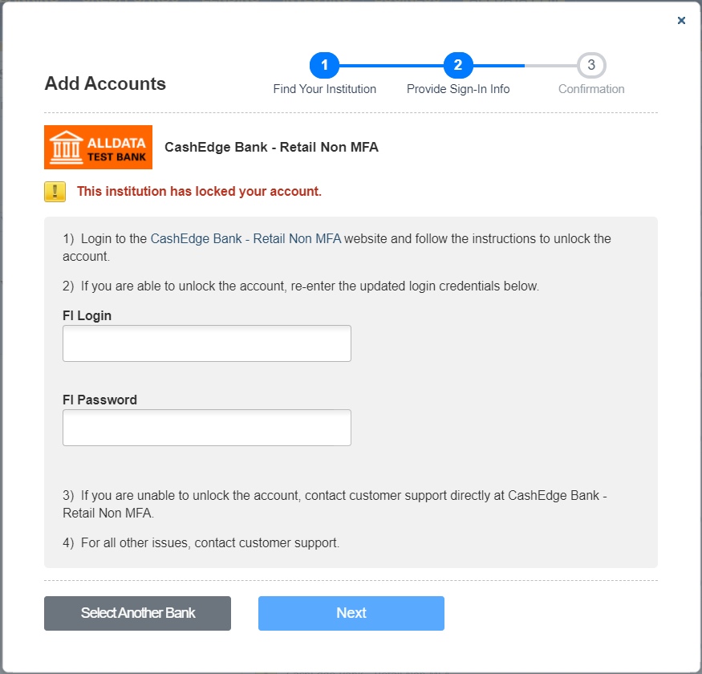

**User intervention required:** Clicking **Next** validates and saves the credentials for the FI, then closes the overlay screen and initiates an account update.

#### Error 311

**Currently unable to update accounts at this institution**

We are actively working on this issue. When this issue has been resolved, your accounts will be automatically updated. We apologize for the inconvenience.

**Information alert:** Fiserv will resolve the issue. After it is resolved, refreshing the account will clear the error.

#### Error 312

Due to an updated connection process with &lt;FI name&gt;, this institution requires all existing users to re-confirm their consent to share data with this application…

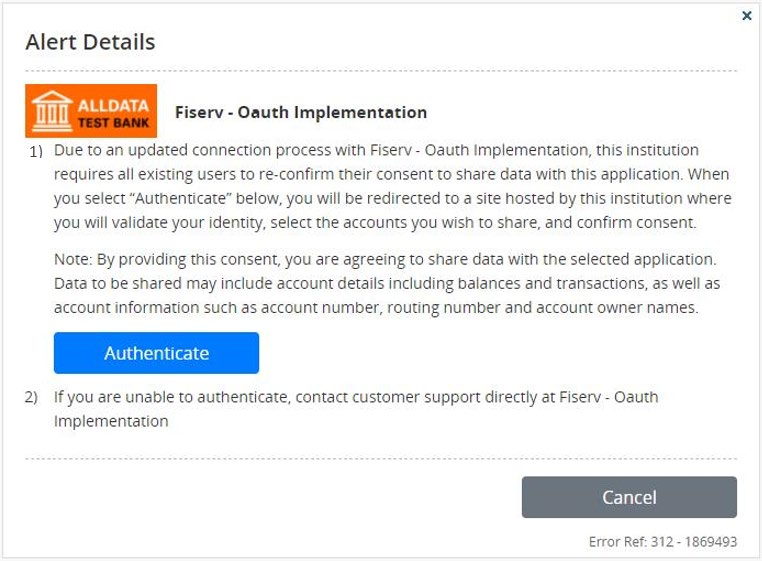

**User intervention required:** The institution has implemented OAuth and the user&#39;s profile is suspended until it is migrated to the OA model. Clicking **Authenticate** opens the institution website where the user must authenticate their login credentials, provide updated consent for account sharing, and select the profile(s) to migrate.

#### Error 400

**Currently unable to update accounts at this institution**

We are actively working on this issue. When this issue has been resolved, your accounts will be automatically updated. We apologize for the inconvenience.

**Information alert:** Fiserv will resolve the issue. After it is resolved, refreshing the account will clear the error.

#### Error 600

**Currently unable to update accounts at this institution**

We are actively working on this issue. When this issue has been resolved, your accounts will be automatically updated. We apologize for the inconvenience.

**Information alert:** Fiserv will resolve the issue. After it is resolved, refreshing the account will clear the error.

#### Error 999

**Currently unable to update accounts at this institution**

We are actively working on this issue. When this issue has been resolved, your accounts will be automatically updated. We apologize for the inconvenience.

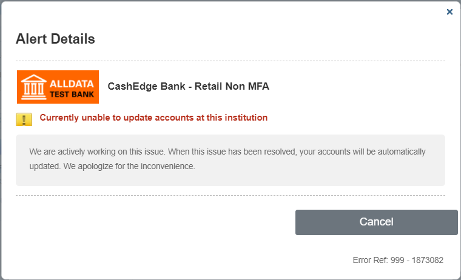

**Information alert:** Fiserv will resolve the issue. After it is resolved, refreshing the account will clear the error.

## Appendix B

### Add Account Label Configuration Options

The following table lists the possible label configurations in the widgets. Partners wishing to customize widget labels can change the default values as desired.

| #  | Page                          | Object type  | Name                            | Default value                                                                                                                               |
|----|-------------------------------|--------------|---------------------------------|---------------------------------------------------------------------------------------------------------------------------------------------|
| 1  | Initial screen                | Label        | Widget title                    | Add Accounts                                                                                                                                |
| 2  | Initial screen                | Label        | Search for your FI              | Search for your financial institution:                                                                                                      |
| 3  | Initial screen                | Label        | Select Popular Institutions     | Or choose from popular financial institutions where you have an account                                                                     |
| 4  | Initial screen                | Label        | Note label for suspended FI     | Note: Institutions with (!) sign are currently not available                                                                                |
| 5  | Initial screen                | Label        | If FI not listed                | Please check the name and try again                                                                                                         |
| 6  | Initial screen                | Label        | Offline account message         | If you have an asset or liability that does not have online access (real estate, auto, jewelry, etc.), click here to add an offline account |
| 7  | Initial screen                | Button label | Next button                     | Next                                                                                                                                        |
| 8  | Login Credentials screen      | Label        | Widget title                    | Add Accounts                                                                                                                                |
| 9  | Initial screen                | Button label | Next button                     | Next                                                                                                                                        |
| 10 | Login Credentials screen      | Label        | Widget title                    | Add Accounts                                                                                                                                |
| 11 | Login Credentials screen      | Label        | Enter your credentials          | Enter your credentials for this institution                                                                                                 |
| 12 | Login Credentials screen      | Label        | Login credentials error message | All fields are required. Please check your entries and try again.                                                                           |
| 13 | Login Credentials screen      | Label        | Error message 301               | The login credentials for this institution’s website may be incorrect.                                                                      |
| 14 | Login Credentials screen      | Label        | Connecting to FI site           | Connecting the institution and securely accessing your account…                                                                             |
| 15 | Account Classification screen | Label        | Account Selection               | Select the accounts from this institution that you want to connect.                                                                         |
| 16 | Account Classification        | Button label | Next button                     | Next                                                                                                                                        |
| 17 | Account Confirmation screen   | Label        | Widget title                    | Add Accounts                                                                                                                                |
| 18 | Account Confirmation screen   | Label        | Added so far                    | List of all accounts added for this institution.                                                                                            |
| 19 | Account Confirmation screen   | Label        | Continue adding more accounts   | To continue adding more accounts, click Add More Accounts.                                                                                  |
| 20 | Account Confirmation screen   | Button label | Add More Accounts button        | Add More Accounts                                                                                                                           |

 
 

© 2020-2021 Fiserv, Inc. or its affiliates. All rights reserved. This work is confidential, and its use is strictly limited. Use is permitted only in accordance with the terms of the agreement under which it was furnished. Any other use, duplication, or dissemination without the prior written consent of Fiserv, Inc. or its affiliates is strictly prohibited. The information contained herein is subject to change without notice. Except as specified by the agreement under which the materials are furnished, Fiserv, Inc. and its affiliates do not accept any liabilities with respect to the information contained herein and are not responsible for any direct, indirect, special, consequential or exemplary damages resulting from the use of this information. No warranties, either express or implied, are granted or extended by this document.

[http://www.fiserv.com](http://www.fiserv.com/)

Fiserv is a registered trademark of Fiserv, Inc.

Other brands and their products are trademarks or registered trademarks of their respective holders and should be noted as such.

 
 

This document has been created by Fiserv and is classified **Fiserv Confidential**. This document is restricted to the received party and not to be forwarded or transferred without the approval of Fiserv.

 
 

Links: [Overview](?path=/docs/alldata-next-gen/overview-integration-approach.md), [Widgets](?path=/docs/alldata-next-gen/widgets.md), [Implementation Approaches](?path=/docs/alldata-next-gen/implementation-approaches.md), [Appendices](?path=/docs/alldata-next-gen/appendices.md)