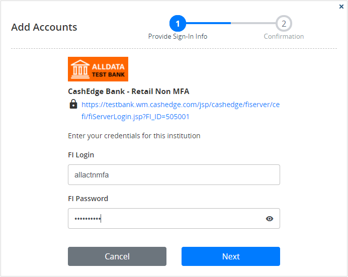
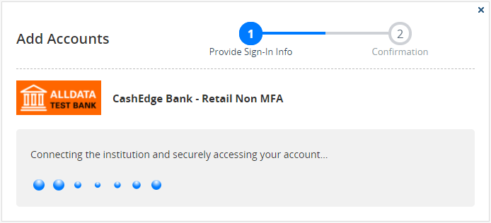
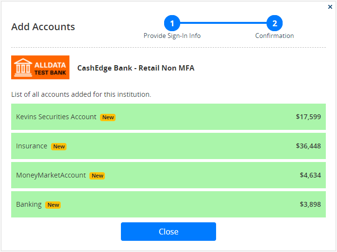
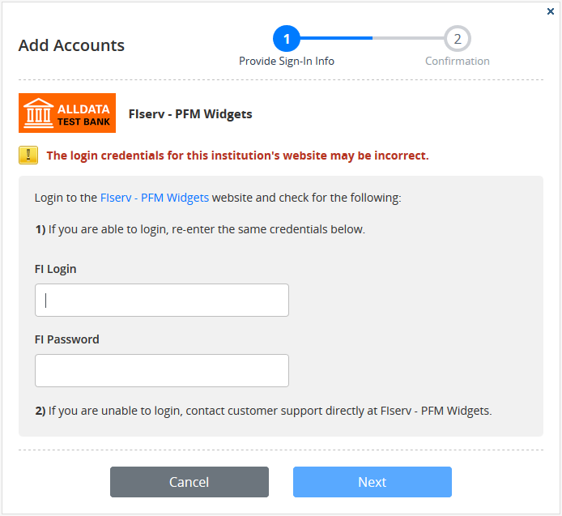
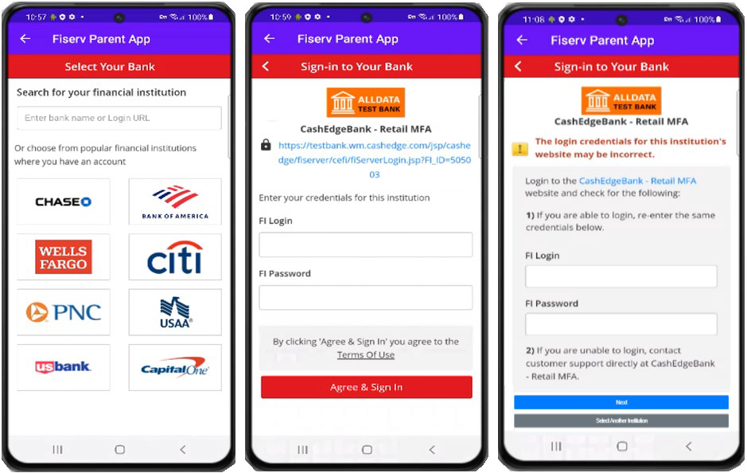
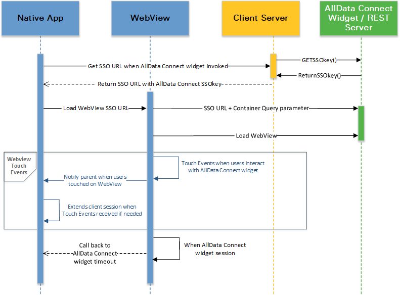
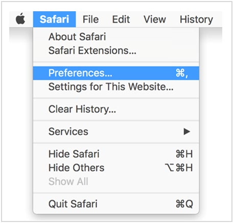
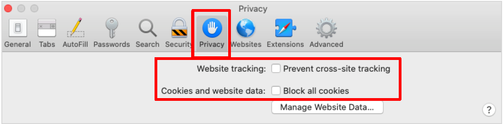
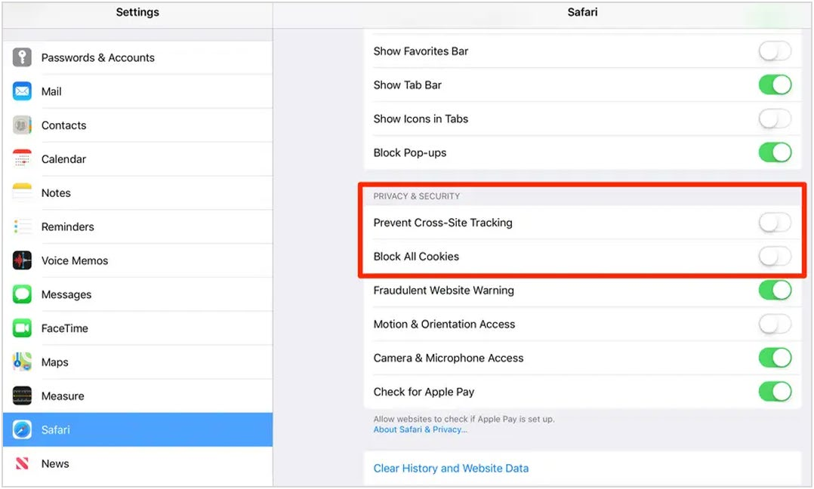

# AllData® Next-Gen Widgets Integration Guide
<sup>November 2021</sup>

<br>

## Implementation Approaches

Partners have alternate approaches to integrate AllData widgets into their applications:

- **Deep linking:** Start the Add Accounts flow directly from the FI credentials submission screen.
- **Native app integration:** Deploy the responsively designed widgets within mobile web and native app implementations.

The following sections describe both approaches in detail.

### Deep Linking

This approach allows partners to directly launch the Add Account widget with the login credentials submission screen for a specific FI that the user chooses, bypassing the default step of searching for the institution. This approach gives partners the flexibility to manage the FI search on their side, with more control over the institutions they wish to support for their users. Partners can pull data from supported financial institutions using the _getFinancialInstInfo_ API. Please refer to the AllData Web Services Specifications Guide provided for more details. Other than bypassing the initial FI search process, the Add Accounts flow for deep linking remains the same as the default flow.

The deep linking approach requires either one of the following parameters in both SAML 2 and session token SSO options for launching the Add Accounts widget.

- **fi\_id:** Required when initiating a fresh add attempt under an institution – This ID represents the FI the user has account with and is available when pulling the FI data using _getFinancialInstInfo_ API.
- **login\_acct\_id:** Required for error resolution and add more accounts available from an existing institution under user profile – This ID represents the login account the user has with the financial institution. This information is available using _getAccountDetails_ API.

In deep linking the following response codes are applicable to different scenarios, such as when the mandatory parameter is sent incorrectly, or missed when launching the widget.

| Response code | Reason                                                                                                                                                                                              |
|---------------|-----------------------------------------------------------------------------------------------------------------------------------------------------------------------------------------------------|
| 3000          | Session expired                                                                                                                                                                                     |
| 3001          | Invalid financial institution ID **fi_id**                                                                                                                                                              |
| 3002          | Invalid login account ID **login_acct_id**                                                                                                                                                              |
| 3003          | When the add flow is successful without returning any account, the user can re-initiate the add flow for the same FI or a different FI. If this response code persists, report the issue to Fiserv. |
| 3005          | Invalid **partner_application_id** required for OAuth FIs                                                                                                                                               |

Example screen shots of the deep linking workflow follow.

**Deep linking image 1 – Enter account credentials:**



**Deep linking image 2 – Progress indicator:**



**Deep linking image 3 – Confirmation screen:**



**Deep linking image 4 – Sample error scenario:**



### Native App Integration

AllData widgets have a responsive design for optimal display in web browsers on desktop, tablet, and mobile devices. The widgets can also be integrated into a partner&#39;s native app. With the responsive design the widgets adjust seamlessly to mobile device screens.

When integrating widgets in a native app, the parameter **host\_app\_type** is required to identify the type of native app implementation, passing a value of either &quot;ios&quot; or &quot;android.&quot;

When identified as a native app integration, the **Cancel** and **Close** buttons in the widget will be removed and partners must manage the navigation back to their source application from the AllData widget when the user wants to close or cancel the widget.



### Widget Integration Using WebView and Native App

This section provides an architectural overview of the mobile integration and invoking of AllData widgets in WebView. It covers the primary components and interfaces comprising the target state solution.

#### Current SSO Process Description and Elements

See the [Integration Approaches](?path=/docs/alldata-next-gen/overview-integration-approach.md#integration-approaches) section for a description of the SSO process and a list of all the applicable elements.

### System Environment

#### Proposed Sequence of Calls

**AllData Widget – WebView integration:**



#### SSO for Mobile

This leverages the aggregation SSO built for online AllData. The parent app must get the one-use SSO key from the existing middleware. The SSO key is then passed to the URL to invoke the AllData widget in WebView. URLs are confirmed during implementation. Partners who continue to invoke the existing Aggregation URL are internally redirected to the Aggregation UI.

#### Sample Pseudocode for Invoking WebView

##### Android

```
WebView loadView =(WebView)
eSignDetailView.findViewById(R.id.<WEBVIEWID>);
    loadView.getSettings().setJavaScriptEnabled(true);
    loadView.setWebChromeClient(new WebChromeClient());
    loadView.loadUrl(<<PFMUrl>>);
```

##### iOS

```
- (void)viewDidLoad {
    [super viewDidLoad];

    NSURL *url = [NSURL URLWithString:@"<<PFMUrl>>"];
    NSURLRequest *urlRequest = [NSURLRequest requestWithURL:url];
    [self. responsiveUIWebView  loadRequest:urlRequest];

    self. responsiveUIWebView .delegate = self;
}
```

#### Session Management

##### Keeping banking session alive

Both iOS and Android platform broadcast touch events for a WebView, so that the parent app can listen and keep the session alive.

##### Handling session timeouts in Aggregation

Aggregation will call a function on the parent app when the session times out. That is depicted in the diagram above.

#### Sample Pseudocode for Handling Session Management

##### Android

```
i. Create interface and expose "Aggregation" TimeOut method and annotate this method with @JavascriptInterface

public class WebAppInterface {
    Context mContext;
    /** Instantiate the interface and set the context */
    WebAppInterface(Context c) {
        mContext = c;
    }

    /** Show a toast from the web page */
    @JavascriptInterface
    public void AllDataUITimeOut() {
        //Parent app can perform action based on time out
    }
}

ii. Call following method on WebView

loadView.addJavascriptInterface(new WebAppInterface(getActivity()), "AllDataAndroidInterface");
```

##### iOS

Controller will extend UIWebViewDelegate and have the following delegate method implemented.

```
- (BOOL)webView:(UIWebView *)webView shouldStartLoadWithRequest:(NSURLRequest *)request navigationType:(UIWebViewNavigationType)navigationType
{
    if ([[[request URL] absoluteString] hasPrefix:@"AllDataUIiOSInterface"]) 
    {
        // Call the given selector
        [self performSelector:@selector(AllDataUITimeOut)];
        // Cancel the location change
        return NO;
    }
    return YES;
}
- (void) AllDataUITimeOut
{
  //Parent app can perform action based on time out
    NSLog(@&"Inside AllDataUITimeOut ");
}
```

### iOS: Cross-Site Tracking and Blocking All Cookies

On March 24, 2020, Apple released updates for its operating systems for desktop and mobile devices.

- Desktop/laptop: OSx 10.15.4 Mojave
- iPhone/iPad: iOS 13.4

With these updates, a change was made to the default setting for the way the Safari browser handles cross-site tracking (third-party cookies). As a result, users who have installed these OS versions or higher cannot access AllData Connect widgets from Mac computers or iOS mobile devices, when the partner has integrated AllData Connect widgets with an iframe (embedded) implementation.

##### User experience

Clients who do not have a custom domain URL setup to access AllData widgets and did iframe implementation, their users attempting to access AllData widgets from a Mac computer or iPad/iPhone using the above listed operating systems versions and higher, receive the error.

##### User action required

In the event a user encounters this problem with Safari, user has to change privacy settings in the Safari browser to allow cookies and cross-site tracking.

##### Desktop / laptop instructions

To change the settings within the Safari browser on a desktop or laptop computer, follow these steps:

1. Go to the **Safari** menu and select **Preferences**.



2. Go to the **Privacy** tab and uncheck the &quot;Prevent cross-site tracking&quot; and &quot;Block all cookies&quot; options.



##### iPad and iPhone instructions

To change the settings within the Safari browser on an iPad, follow these steps:

Step 1: Go to Settings for Safari

Open the &quot;Settings&quot; app on your device and select Safari to open the Settings screen for Safari.

Step 2: Change Privacy &amp; Security Settings

In the Privacy &amp; Security section of the Setting screen. Make sure the options for &quot;Prevent Cross-Site Tracking&quot; and &quot;Block All Cookies&quot; are turned off.



<br>
<br>
<hr>

© 2020-2021 Fiserv, Inc. or its affiliates. All rights reserved. This work is confidential, and its use is strictly limited. Use is permitted only in accordance with the terms of the agreement under which it was furnished. Any other use, duplication, or dissemination without the prior written consent of Fiserv, Inc. or its affiliates is strictly prohibited. The information contained herein is subject to change without notice. Except as specified by the agreement under which the materials are furnished, Fiserv, Inc. and its affiliates do not accept any liabilities with respect to the information contained herein and are not responsible for any direct, indirect, special, consequential or exemplary damages resulting from the use of this information. No warranties, either express or implied, are granted or extended by this document.

[http://www.fiserv.com](http://www.fiserv.com/)

Fiserv is a registered trademark of Fiserv, Inc.

Other brands and their products are trademarks or registered trademarks of their respective holders and should be noted as such.

<br>
<br>

This document has been created by Fiserv and is classified **Fiserv Confidential**. This document is restricted to the received party and not to be forwarded or transferred without the approval of Fiserv.


