# AllData® Next-Gen Widgets Integration Guide
November 2021

 

## Add Accounts Widget

This section describes the workflow and functionality of the Add Accounts widget. The Add Accounts workflow starts with the user selecting the financial institution holding the account(s) and sharing login credentials to allow the system to add the account(s) and aggregate data from the institution. AllData provides two approaches to launching the Add Accounts widget in a partner application: The default method is the user searching for an institution or selecting one from a list of popular FIs. The alternate approach is called &quot;[deep linking](?path=/docs/alldata-next-gen/implementation-approaches.md#deep-linking).&quot;

### Add Accounts Workflow

By default, the Add Accounts widget includes the necessary screens to walk the user through adding a single financial institution at a time. After submitting credentials for an FI, the harvesting process starts, and the UI shows a progress indicator until the next screen displays. Any harvesting errors must be resolved before the user continues. After the account balances are successfully retrieved, a confirmation screen appears in the Add Accounts widget.

**Add Accounts workflow:**

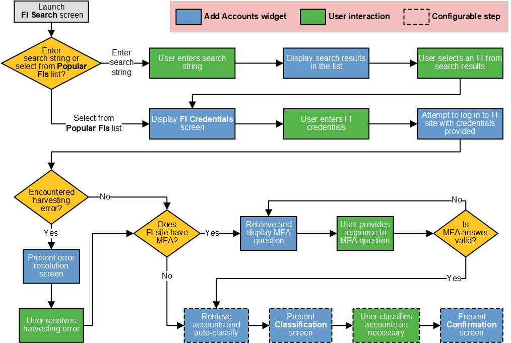

When the Add Accounts widget is launched, the FI search screen appears first. The FI search screen presents the user with four different options to continue: (1) enter a search string for the desired FI, (2) select from the list of popular FIs, (3) navigate to the offline account addition screens, and (4) add real estate values powered by Zillow.

**New Add Accounts widget – FI search screen:**

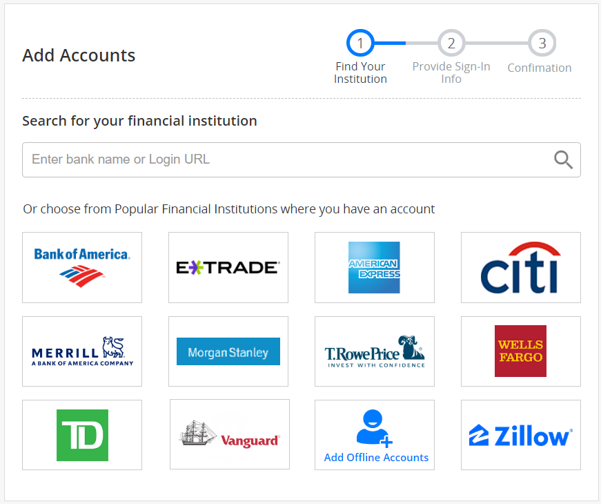

Partners have the option to configure the popular financial institutions of their choice to display when launching the Add Account widget. The popular financial institution logos are displayed in the FI search screen, and the user can choose a logo to add one or more accounts under the selected institution. Partners have a choice of ten or twelve institutions to show under the popular list, based on whether they choose to display the Add Offline Accounts and Zillow logos.

The FI search algorithm uses &quot;word searching&quot; instead of &quot;letter searching.&quot; The search string returns matches starting at the beginning of each of the words in the FI name, instead of any part of the FI name.

When the user enters three letters, an auto-complete dropdown appears below the search field. The number of matches to the user-entered text appears below the search field. The auto-complete functionality initially loads the first ten matches, with the institutions&#39; respective logos. A **Show More** button appears at the bottom of the widget to optionally display more matching institutions from the result set.

Clicking **Show More** includes another ten institution from the result set in the drop-down list. Repeated clicks on the button reveal additional sets of ten institutions from the results until there are no further matches, when the **Show More** button disappears.

**Add Accounts screen – FI search auto-complete screen:**

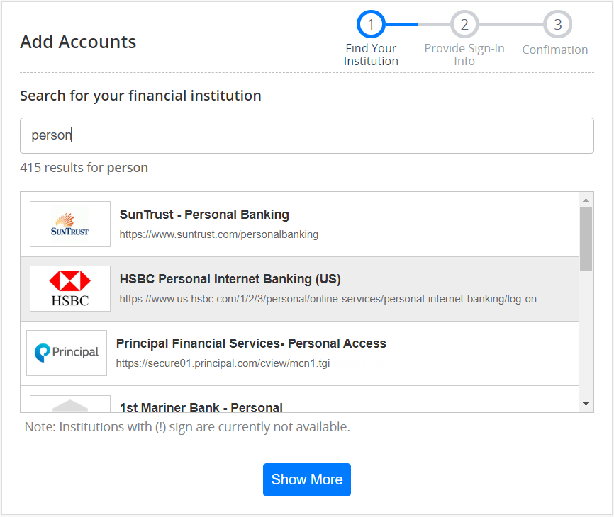

From the search results screen the user can enter another search string, return to the initial Add Accounts screen, or select an FI from the results list to add accounts. Selecting a result opens the credentials submission screen for that institution.

**Add Accounts screen – Credential submission screen:**

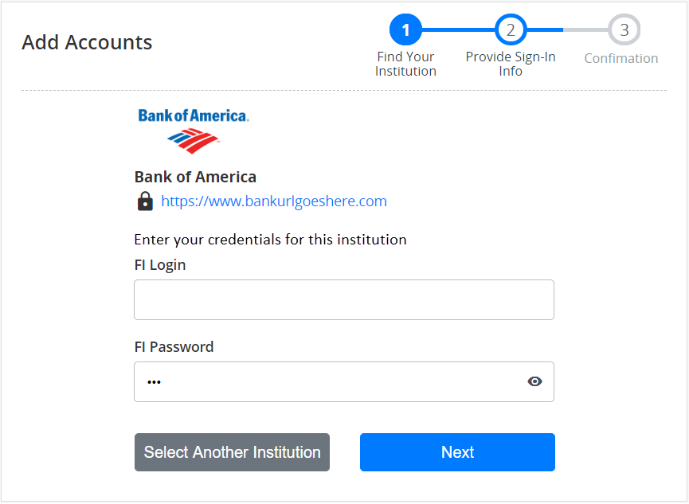

When FI request their users to do additional setup to allow aggregating from their website, the information to do additional setup will be provided as special instructions on choosing FI to add accounts. Users need to follow the special instructions before adding accounts from that FI.

Same instructions will be provided on the top of credentials submission screen of that FI. Users can choose **Show More** to view the complete instructions.

**Add Accounts screen – Special instructions for users:**

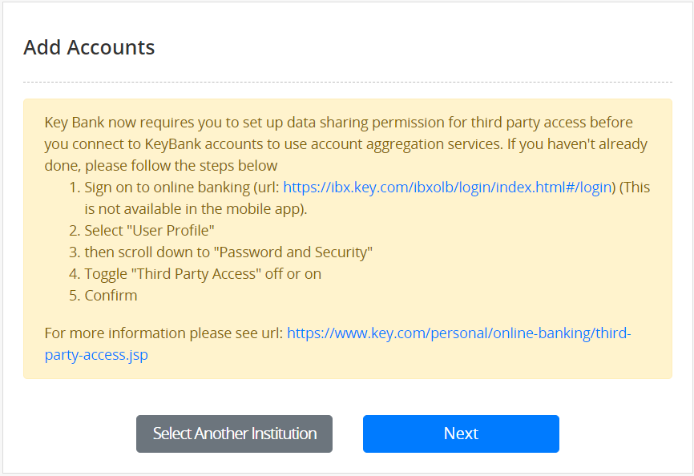

**Add Accounts screen – Special instructions in credentials submission form:**

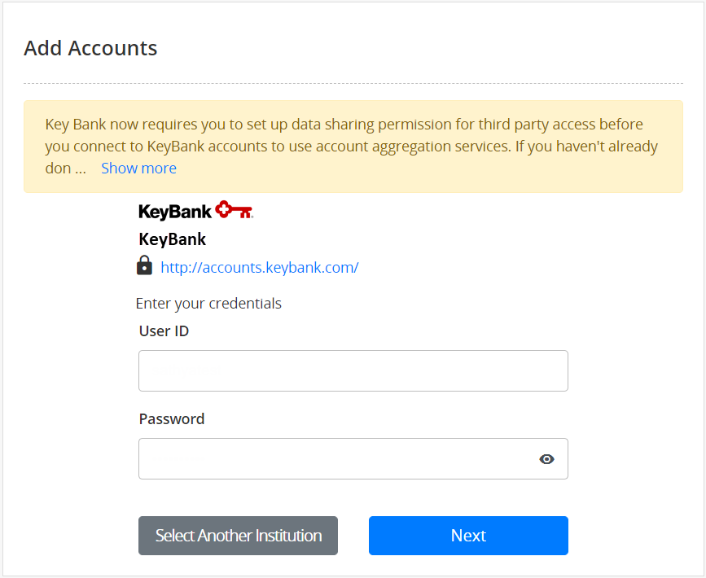

After the user provides credentials, an &quot;in-progress&quot; screen displays while the harvesting process attempts to access the FI and retrieve the accounts. The user must wait for the harvesting process to return a result before continuing the process.

After successfully harvesting data, the widget shows the Account Classification screen if it is configured. Otherwise it shows the Account Confirmation screen if it is configured. If both screens are turned off, the widget calls the **return\_url** to return control back to the partner application. This invocation of **return\_url** contains two parameters ( **FILoginAcctId** and **AcctId** ) which signify the newly added accounts. The **FILoginAcctId** contains one ID referring to the parent login ID record that the user submitted the credentials for. The **AcctId** contains a comma-separated list of accounts that are accessible with these login credentials and are referred to as children accounts.

If the harvest attempt fails due to a harvest alert, the corresponding alert resolution screen appears.

**Add Accounts screen – In-progress screen:**

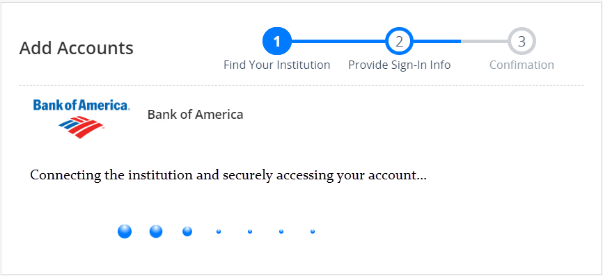

If the harvesting process encounters any errors, they will display within the Add Accounts widget. The alert content and workflows are included in [Appendix A – Harvesting Alert Error Resolution Screens](?path=/docs/alldata-next-gen/appendices.md#harvesting-alert-error-resolution-screens).

**Add Accounts Screen – Harvesting alert:**

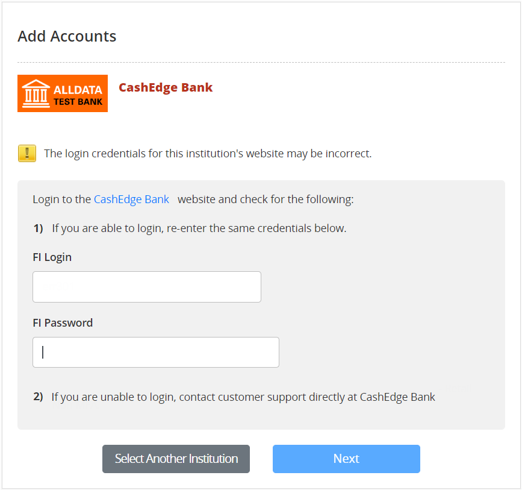

After the user resolves the harvesting error through the alert resolution screen, another harvesting attempt initiates. The Add Accounts widget displays the in-progress screen until the harvest completes.

If the harvest attempt is successful, and if the configuration parameter is set to True, the Account Classification screen appears. If the harvest attempt fails due to a harvest alert, the next screen will display either the corresponding alert resolution screen or the account confirmation screen, depending on the partner configuration.

After the accounts are retrieved, if the Account Classification screen is enabled, an inventory of the child accounts appears with the account names, types, and totals.

On the Account Classification screen, the user can do the following.

- Select accounts to add or exclude from the service
- Edit account names and account types
- Resolve account type classification errors (208 and 209), if applicable

**Add Accounts screen – Account Classification:**

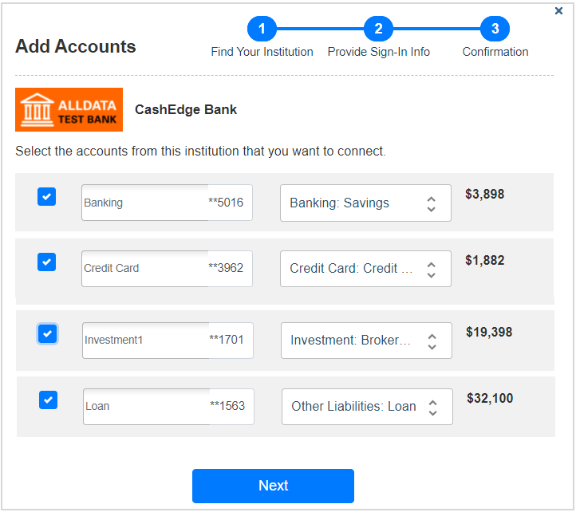

After successfully adding accounts to the user&#39;s profile, a confirmation screen appears. It lists each added account by name along with the last four digits of its account number, account type, and current balance.

From the confirmation screen, the user can close the Add Accounts screens or start the Add Accounts process over again by clicking **Add More Accounts** and returning to the FI search screen.

**Add Accounts screen – Confirmation screen:**

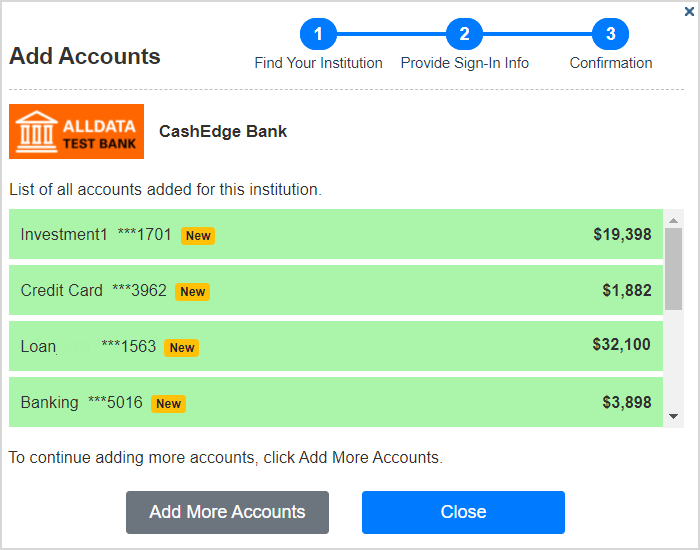

After the Add Accounts widget process is complete, the widget calls the return URL to return control back to the partner application.

### Add Accounts Workflow (OAuth)

AllData supports OAuth (Open Authorization), an open standard authorization framework for token-based authorization on the internet. This protocol allows users to grant a third-party website or application access to their protected resources, without necessarily revealing their long-term credentials or even their identity. It also helps financial institutions identify and allow the trusted intermediary (the third party) to gather users&#39; financial data through APIs.

Partners must provide a list of their applications that they will integrate AllData widgets into, including &quot;application name&quot; (string) and &quot;application ID&quot; (alphanumeric) to our Professional Services team during implementation. We will register the partner applications so that FIs can identify them and grant access to user data when requested. Partners must notify Fiserv of any future application integrations with AllData widgets so that those applications can also be registered with institutions for use with OAuth.

Application ID is an optional parameter to be passed as a SAML 2.0 attribute or an SSO parameter. Partners integrating AllData widgets into multiple applications should send the respective Application ID when invoking a widget. AllData recognizes the Application ID, passes the appropriate information to the FI website during user authorization, and accesses user account information.

Fiserv works with institutions to implement OAuth integration to aggregate account information. We notify partners as new FIs are integrated and ready to support OAuth. When the partner is ready to support an FI with OAuth, AllData activates the protocol for that institution.

When users attempt to add accounts from an OAuth-implemented FI, a message appears with information about the FI site sharing data with AllData and requests consent. Clicking **Authenticate** redirects to the FI-hosted website. From there, users validate their identity with their login credentials, select the account(s) they wish to aggregate through the application, and provide their consent.

After authorization and consent, the institution sends AllData an access token to access user account information and gather data through the APIs. AllData manages the token and continues to use it to gather account information. Users who wish to revoke their consent and remove any accounts shared with the application can use the Add More Accounts process to revoke their consent.

**Add Accounts Screen – OAuth Implemented FI:**

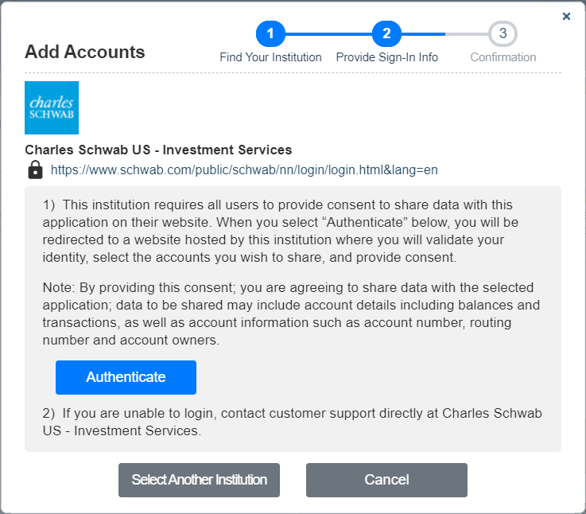

**Add Accounts – Institution hosted website:**

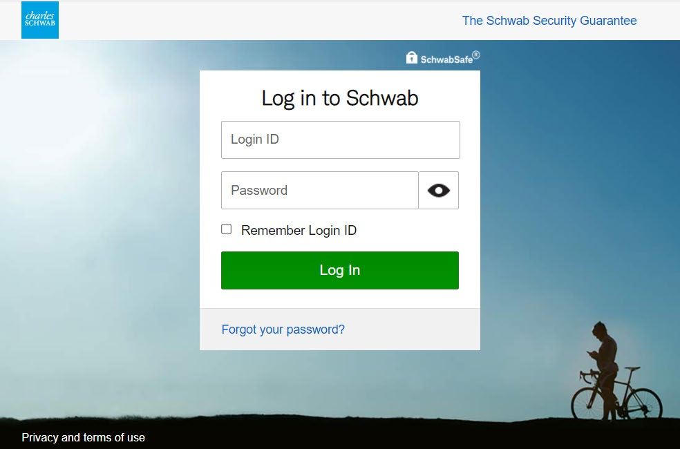

**Consent Page – Institution hosted website:**

**Select Account – Institution hosted website:**

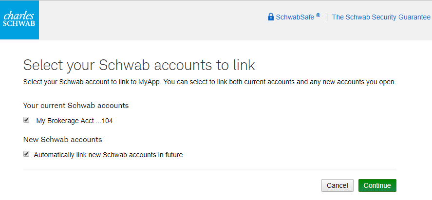

Users can follow on-screen instructions to authenticate and add new accounts under OAuth-implemented institutions. Users with profiles added to an OAuth-implemented FI through the standard (non-OAuth) approach receive a notice upon launching the Add Account widget prompting them to migrate their profile to the OAuth model. After successfully migrating, the login credentials previously stored for the standard approach are deleted from AllData and the token shared by the institution is used to aggregate account information.

**Add Accounts Screen – OAuth migration User Notification:**

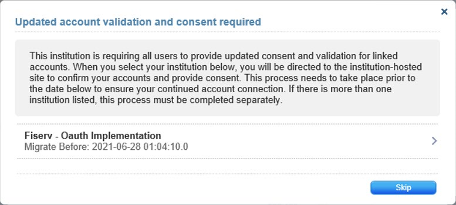

If a user has a profile under multiple institutions that are converted to OAuth by Fiserv, a notification lists the FIs and encourages the user to migrate them.

**Add Accounts Screen – OAuth migration User Notification (Multiple OAuth FIs):**

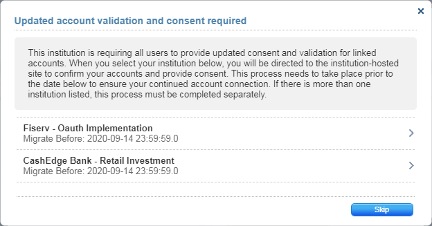

**Add Accounts Screen – User with single profile under an institution:**

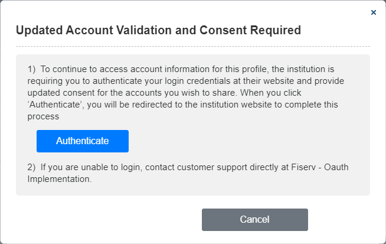

A user with multiple profiles under an institution selects the profile to migrate from a list.

**Add Accounts Screen – User with multiple profile under an institution:**

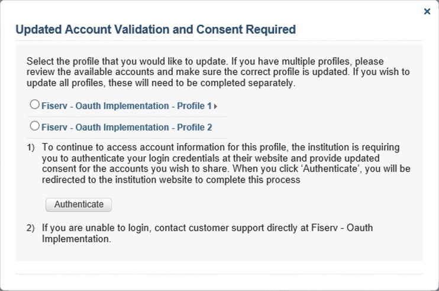

After selecting a profile on the previous screen, the accounts added under that profile appears. This is to help the user confirm the correct profile selection and to list all the existing accounts in AllData so that the user can be sure to choose all the same accounts in the account selection screen on the FI-hosted website. If the user fails to choose an existing account, the institution will not return that account information to Fiserv in their API and account updates will fail.

**Add Accounts Screen – Verify underlying accounts and reconfirm the profile for migration**

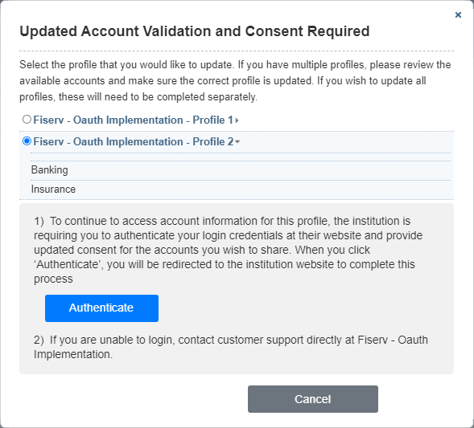

If an issue occurs during the OAuth workflow process, the following message appears to prompt the user to re-initiate the authentication process.

**Add Accounts Screen – Failure scenario in OAuth workflow**

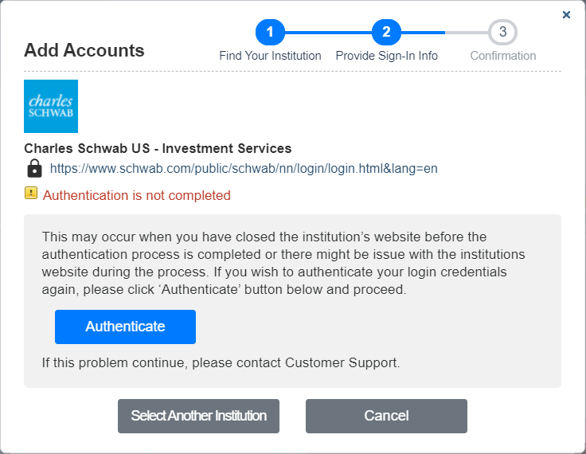

Fiserv enters into individual agreements with financial institutions to move them to the OAuth model. An institution may provide a threshold period to support both standard and OAuth workflows, allowing existing users to migrate to the OAuth model. After the deadline, user profiles that have not migrated to OAuth will be marked with the 312 error code and suspended for update. Suspended users must migrate their profiles immediately to update their accounts again.

**Error 312 – OAuth Implementation:**

### Text Configurations via Resource Bundles

AllData widgets use resource bundles to persist most of the text that users see in the widget screens. This allows partners to customize the language and content to meet their business requirements. The following section identifies the configurable text in the primary screens in the Add Accounts widget.

**Initial screen – Pre-search labels:**

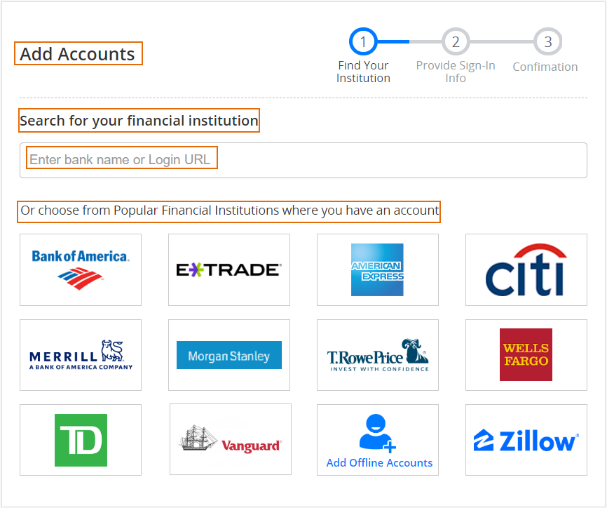

The following table provides the labels and default values for configurable elements of the initial screen.

| # | Label | Default value |
|---|----------------------|--------------------------------------------------------------------------|
| 1 | Widget title | Add Accounts |
| 2 | Search for your FI | Search for your financial institution: |
| 3 | FI search suggestion | Enter Bank or Login URL |
| 4 | Popular FI Select | Or Choose from Popular Financial Institutions where you have an account. |

**Login Credentials screen:**

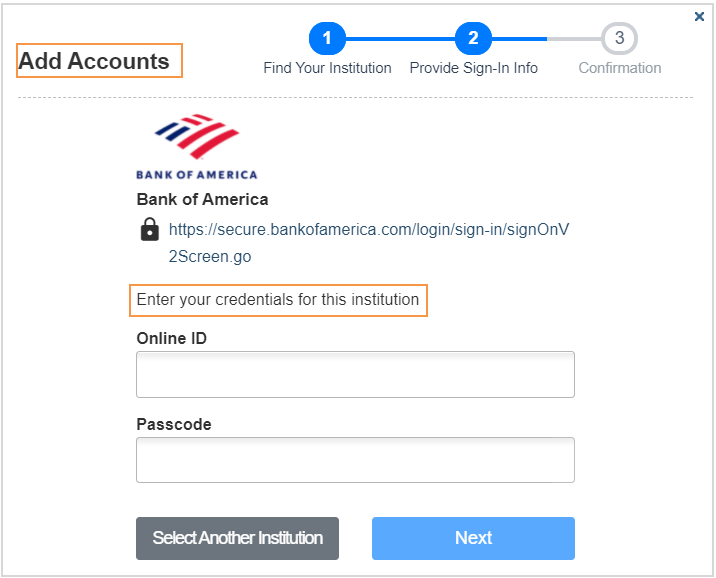

**Login Credentials screen – Access failure:**

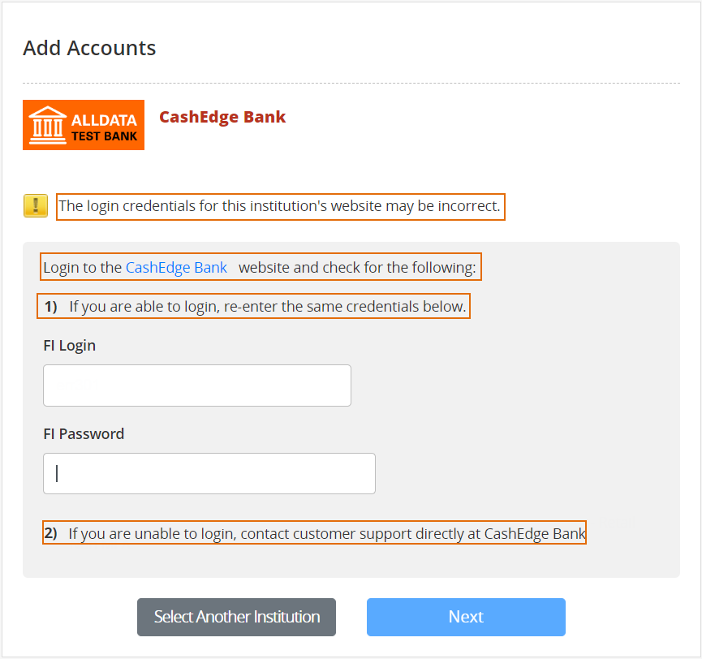

The following table provides the labels and default values for the configurable elements of the Login Credentials screen.

| #  | Label | Default value |
|----|------------------------|----------------------------------------------------------------------------------|
| 5  | Widget title | Add Accounts |
| 6  | Enter your credentials | Enter your credentials for this institution |
| 7  | Primary message | The login credentials for this institution’s website may be incorrect. |
| 8  | Instructions | Login to &lt;FI name&gt; website and check for the following:                          |
| 9  | Step 1 | If you are able to login, please re-enter the same credentials below: |
| 10 | Step 2 | If you unable to login, contact customer support directly at &lt;Institution Name&gt;. |

**Retrieval screen:**

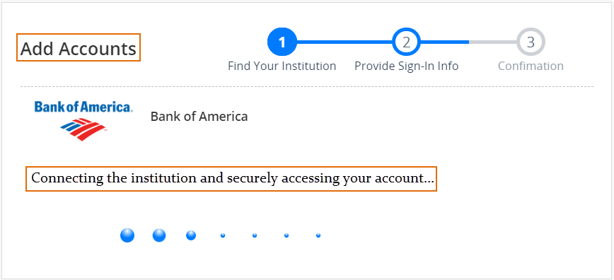

The following table provides the labels and default values for the configurable elements of the Retrieval screen.

| # | Label | Default value |
|----|--------------------------------------------|-----------------------------------------------------------------|
| 11 | Widget title | Add Accounts |
| 12 | Connecting and retrieval assurance message | Connecting the institution and securely accessing your account… |

**Account Confirmation screen:**

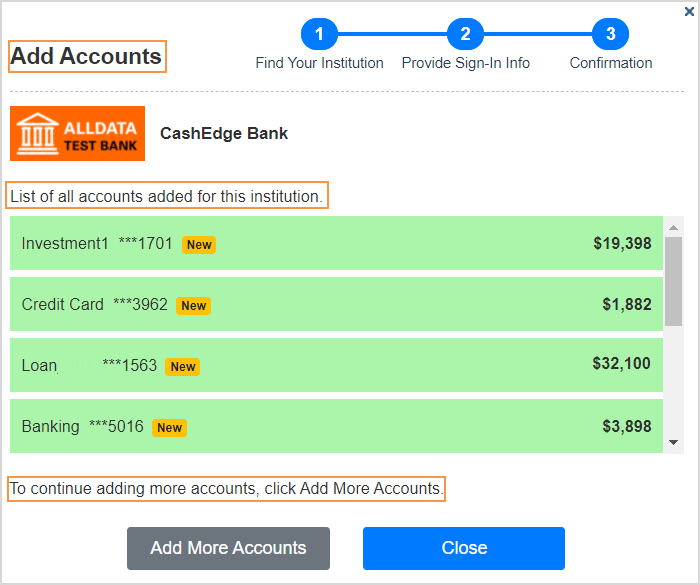

The following table provides the labels and default values for the configurable elements of the Account Confirmation screen.

| #  | Label | Default value |
|----|-------------------------------|----------------------------------------------------------------|
| 13 | Widget title | Add Accounts |
| 14 | Added Accounts | List of all account that have been added for this institution. |
| 15 | Continue adding more accounts | To continue adding more accounts, click Add more Accounts. |

### Button Label Configuration

The labels on each button that is available in the Add Account widget are configurable, with a default value. Details for each label and their default value are as follows:

**Initial screen:**

The following table provides the description and default label of the button on the Search Results screen.

| #  | Description      | Default label |
|----|------------------|---------------|
| 16 | Show More button | Show More     |

**Login Credentials screen:**

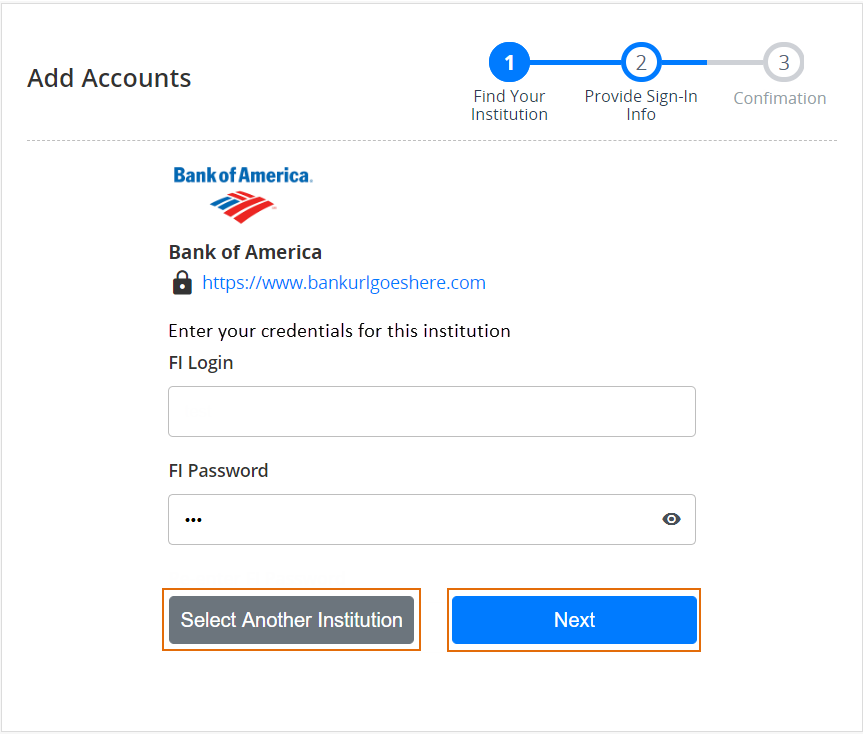

The following table provides the descriptions and default labels for the buttons on the Login Credentials screen.

| #  | Description | Default label |
|----|--------------------------|----------------------------|
| 17 | Select Another FI button | Select Another Institution |
| 18 | Next button | Next |
| 19 | Submit button | Submit |

**Account Confirmation screen:**

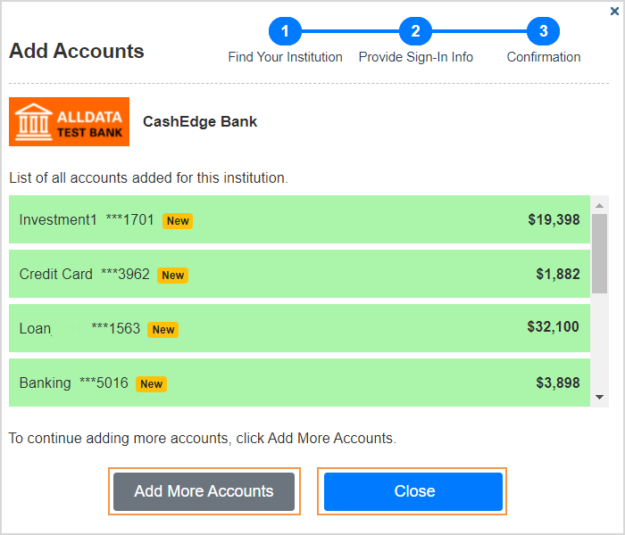

The following table provides the descriptions and default labels for the buttons on the Account Confirmation screen.

| #  | Description              | Default label     |
|----|--------------------------|-------------------|
| 20 | Add More Accounts button | Add More Accounts |
| 21 | Close button             | Close             |

### Offline Account Link

On the initial screen of the Add Accounts widget, there is an option in the popular institutions called **+Add Offline Accounts**. The URL to which this button points is configurable. The property may be passed to the Fiserv application via a pre-configured property or via a parameter in SSO (refer to the [Integration Approaches section](?path=/docs/alldata-next-gen/implementation-approaches.md#implementation-approaches) for more information).

The content displayed in the Add Accounts screen to access the +Add Offline Account functionality is also configurable.

**+Add Offline Accounts logo:**

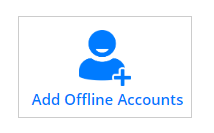

If the property is not set, the **+Add Offline Accounts** link will direct to the native offline account functionality. If the property is set to a partner-specified URL, the link will open the URL within the widget frame.

**Add Offline Accounts native functionality:**

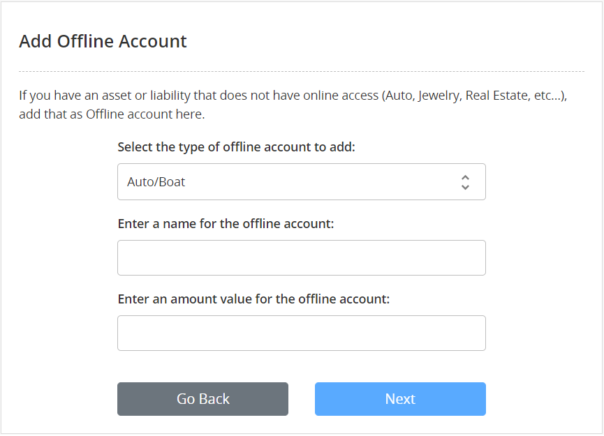

The native Add Offline Account screen lets users select an account type from a predefined selection list, provide a name for the account, and enter a value amount.

### Zillow (Zestimate®)

Zillow is the leading real estate marketplace dedicated to empowering consumers with data, inspiration, and knowledge around the place they call home. The &quot;Zestimate&quot; home valuation model is Zillow&#39;s estimate of a home&#39;s market value. The Zestimate incorporates public and user-submitted data, and considers home facts, location, and market conditions.

Fiserv has built the capability to aggregate Zestimate property values from Zillow with property information shared by users. To obtain the property value, Fiserv and Zillow have agreed to brand Zillow as the information provider wherever the Zillow FI and Zestimate information appear. Partners who wish to enable Zillow as an option in the Add Accounts widget should do the Zillow branding in their UI when displaying the Zillow FI information.

Include the following in the partner UI when displaying the Zillow (Zestimate) information.

- Zillow logo: [http://www.zillow.com/widgets/GetVersionedResource.htm?path=/static/logos/Zillowlogo\_150x40.gif](http://www.zillow.com/widgets/GetVersionedResource.htm?path=/static/logos/Zillowlogo_150x40.gif)
- Zillow &quot;Terms of Use&quot; link: [http://www.zillow.com/corp/Terms.htm](http://www.zillow.com/corp/Terms.htm)
- &quot;What&#39;s a Zestimate&quot; link: [http://www.zillow.com/zestimate/](http://www.zillow.com/zestimate/)

**Zillow branding in UI (sample):**

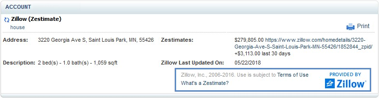

**Zillow property information submission screen:**

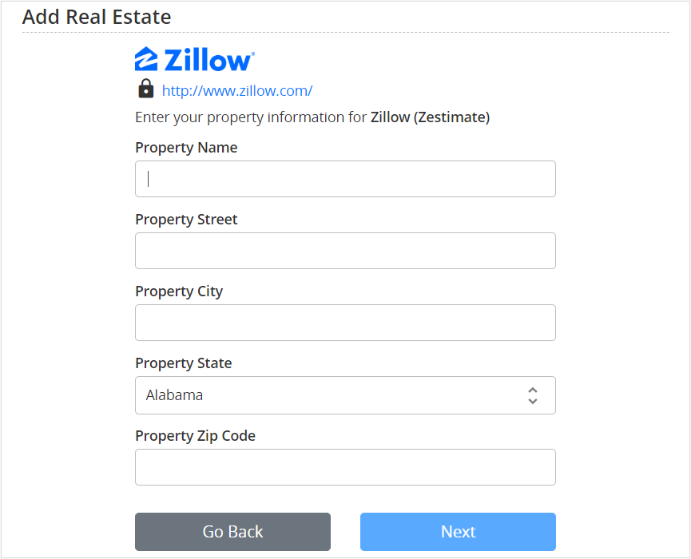

### FI List

Partners can define the financial institutions that are available for users to add in the Add Accounts widget. If an FI is blocked, it will not appear in any search results and cannot be added to the partner&#39;s home. Partners should work with the Fiserv Professional Services team to get a full list of FIs that are supported and determine which ones to allow/block to meet their business requirements.

### Popular Financial Institutions List

Partners can configure the FIs that appear as popular institutions represented by their logos in the initial Add Accounts screen. Additionally, partners may choose whether to display twelve popular FI logos or ten logos plus an **Add Offline Accounts** button and a **Zillow** button on the initial screen of the widget. Clicking an institution logo in the popular institutions list takes the user to the corresponding credential submission screen.

**Popular financial institutions list:**

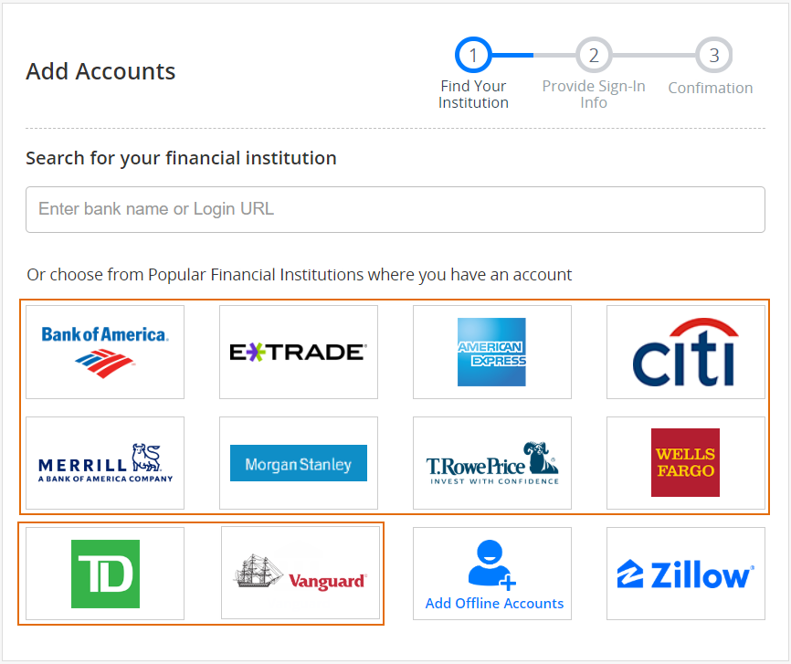

The popular institutions list is configurable but will display a default list if not configured by the partner.

### FI Popularity Index

Partners can configure their own FI popularity ranking list by assigning popularity index values to the financial institutions that they would like to display more prominently in the Add Accounts widget search results screen. When showing search results, the FIs with the ten highest popularity index values among the complete search results will display above any other matching FIs.

Partners can assign index values to make certain financial institutions rank more prominently in search results in the Add Accounts widget

### Account Type Whitelist

The Add Accounts widget allows the partner to select the types of accounts to allow users to add within their home. The partner selects the account types, extended account types, and instrument values to be included in an account type whitelist that will define the accounts that are supported within their home.

During the add accounts process, if an account is auto-classified to an account type and extended account type value that is not included in the home&#39;s account type whitelist, the process will ignore the account and not add it to the service.

Account types available to be included in account type whitelist:

| Account category               | Account type              | Account type whitelist |
|--------------------------------|---------------------------|------------------------|
| Banking                        | Certificate of Deposit    |                        |
|                                | Cash Management           |                        |
|                                | Checking                  |                        |
|                                | Money Market              |                        |
|                                | Savings                   |                        |
| Bill                           | Billing                   |                        |
|                                | Landline Phone            |                        |
|                                | Streaming Media           |                        |
|                                | Mobile Phone              |                        |
|                                | Internet                  |                        |
|                                | Cable/Satellite TV        |                        |
| Education savings              | 529 / Education Savings   |                        |
| Insurance                      | Annuity                   |                        |
|                                | Term Life                 |                        |
|                                | Universal Life            |                        |
|                                | Whole Life                |                        |
|                                | GIC/Term Investment (GIC) |                        |
| Investment                     | Brokerage                 |                        |
| Other liabilities              | Credit Card               |                        |
|                                | Loan                      |                        |
|                                | Auto Loan                 |                        |
|                                | Investment Loan           |                        |
|                                | Student Loan              |                        |
|                                | Line of Credit            |                        |
|                                | Other Liability           |                        |
| Mortgage and home equity loans | Mortgage                  |                        |
|                                | Home Equity Loan          |                        |
| Retirement                     | 401 (k)                   |                        |
|                                | 403 (b)                   |                        |
|                                | 457                       |                        |
|                                | Deferred Comp Plan        |                        |
|                                | KEOGH                     |                        |
|                                | Pension                   |                        |
|                                | Profit Sharing Plan       |                        |
|                                | IRA                       |                        |
|                                | IRA – Roth                |                        |
|                                | IRA – Rollover            |                        |
|                                | IRA – Sep                 |                        |
|                                | IRA – Simple              |                        |

Additionally, only account types that are included in the Account Type whitelist for the partner will display in the account type dropdown boxes that display in the following screens: account classification screen (Add Accounts widget), account classification error (Alerts screen), account management screen (Account Management widget).

### Account Type Name Lookup Table

The Add Accounts widget includes Account Type Name lookup feature that allows the partner to rename the account types that are supported within the home. The partner can use the following list to rename account types according to their requirements.

Sample Account Type Name lookup:

| Account category               | Fiserv account type name  | Partner account type name |
|--------------------------------|---------------------------|---------------------------|
| Banking                        | Certificate of Deposit    |                           |
|                                | Cash Management           |                           |
|                                | Checking                  |                           |
|                                | Money Market              |                           |
|                                | Savings                   |                           |
| Bill                           | Billing                   |                           |
|                                | Landline Phone            |                           |
|                                | Streaming Media           |                           |
|                                | Mobile Phone              |                           |
|                                | Internet                  |                           |
|                                | Cable/Satellite TV        |                           |
| Education savings              | 529 / Education Savings   |                           |
| Insurance                      | Annuity                   |                           |
|                                | Term Life                 |                           |
|                                | Universal Life            |                           |
|                                | Whole Life                |                           |
|                                | GIC/Term Investment (GIC) |                           |
| Investment                     | Brokerage                 |                           |
| Other liabilities              | Credit Card               |                           |
|                                | Loan                      |                           |
|                                | Auto Loan                 |                           |
|                                | Investment Loan           |                           |
|                                | Student Loan              |                           |
|                                | Line of Credit            |                           |
|                                | Other Liability           |                           |
| Mortgage and home equity loans | Mortgage                  |                           |
|                                | Home Equity Loan          |                           |
| Retirement                     | 401 (k)                   |                           |
|                                | 403 (b)                   |                           |
|                                | 457                       |                           |
|                                | Deferred Comp Plan        |                           |
|                                | KEOGH                     |                           |
|                                | Pension                   |                           |
|                                | Profit Sharing Plan       |                           |
|                                | IRA                       |                           |
|                                | IRA – Roth                |                           |
|                                | IRA – Rollover            |                           |
|                                | IRA – Sep                 |                           |

When account type names are displayed on the user interface, the Account Type Name lookup table is used to identify the correct names to display for each partner.

If an account type is not on the account type whitelist for a partner, it will not display at all, regardless of the value in the Account Type Name lookup table.

### FI Request

The Add Accounts widget includes a configurable option to allow a user to request adding a new FI to the service, meaning an institution that Fiserv does not currently support. During this process Fiserv will develop scripts to access the new FI. This feature is only available if the partner has discussed and agreed to the process as part of the contract with Fiserv.

When this option is enabled, the FI request message appears in the Add Account widget screen after the user&#39;s search for an FI returns no matches. A link directs the user to a request form to submit the FI name and URL.

The following areas of the FI Request screen are customizable:

- &quot;Search for your financial institution&quot; label
- Search result message beneath text box
- Body contents

**No Search Results Found Message with New FI Request Enabled:**

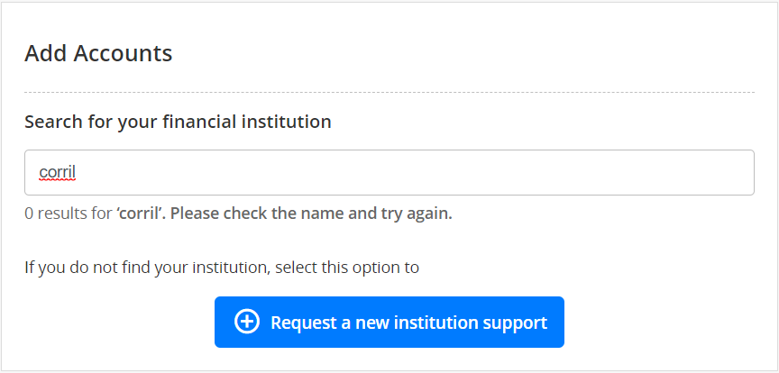

If the FIRequest option isnot enabledforthepartner,the **Request a new institution support** button does not appear when there are no search results.

**No Search Results Found Message without FI Request Enabled:**

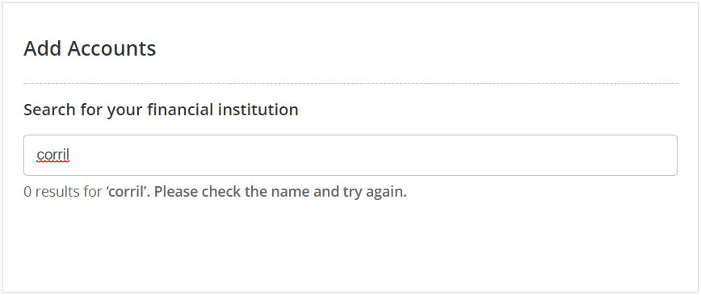

### Add Account Screens CSS Definition

##### Primary CSS Classes

The following table provides an inventory of the primary CSS classes that control the look and formatting of the Add Accounts widget screens:

|#|CSS class|Description|CSS parameter and default value|
|--- |--- |--- |--- |
|1|Background color|This parameter controls the background color that obscures the main screen when the Add Accounts screen overlays are activated.|.wrapper { &nbsp;&nbsp;background: #fff; &nbsp;&nbsp;margin: 15px 0; }|
|2|Widget screen header|This parameter controls the font style of the main header of the Add Accounts screen overlays.|h1.main { &nbsp;&nbsp;font-size: 20px; &nbsp;&nbsp;font-weight: 600; &nbsp;&nbsp;line-height: 28px; &nbsp;&nbsp;align-items: center; &nbsp;&nbsp;display: flex; &nbsp;&nbsp;color: #333; &nbsp;&nbsp;margin-bottom: 5px; }|
|3|Gray color button|This parameter controls the color of the button on the Add Accounts screen.|.btn-secondary { &nbsp;&nbsp;color: #fff; &nbsp;&nbsp;background-color: #6c757d; &nbsp;&nbsp;border-color: #6c757d; }|
|4|Blue color button|This parameter controls the color of the button on the Add Accounts screen.|.btn-primary { &nbsp;&nbsp;color: #fff; &nbsp;&nbsp;background-color: #007bff; &nbsp;&nbsp;border-color: #007bff; }|
|5|Error header|This parameter controls the font style of the error header on the Add Accounts screen.|.alert_redtext { &nbsp;&nbsp;background:url(../images/icons/alerts.png) no-repeat 5px 0px; &nbsp;&nbsp;font-size:1.15em; &nbsp;&nbsp;color:#b83320; &nbsp;&nbsp;padding:5px 0 10px 40px; &nbsp;&nbsp;margin:8px 0px; &nbsp;&nbsp;font-weight:bold; }|
|6|Content background|This parameter controls the content background.|.accSelect { &nbsp;&nbsp;background: #f1f1f1; &nbsp;&nbsp;font-size: 14px; &nbsp;&nbsp;padding: 15px 20px 5px 20px; &nbsp;&nbsp;border-radius: 5px; &nbsp;&nbsp;-webkit-border-radius: 5px; /* Safari 3-4, iOS 1-3.2, Android 1.6- \*/ &nbsp;&nbsp;-moz-border-radius: px; /* Firefox 1-3.6 \*/ }|
|7|Links|This parameter controls the font style of the links (for example, offline account, FI URL, and popular FI links).|a { &nbsp;&nbsp;color: #007bff; &nbsp;&nbsp;text-decoration: none; &nbsp;&nbsp;background-color: transparent;  }|
|8|Search results message|This parameter controls the panel that displays below the search field.|.resultCount { &nbsp;&nbsp;margin: 5px 0 0 0; &nbsp;&nbsp;color: #666;  }|
|9|Validation error message|This parameter controls the panel that displays when there are field level validation errors.|.iceMsgsError, .warningtip { &nbsp;&nbsp;list-style: none; &nbsp;&nbsp;color: #000000; &nbsp;&nbsp;background-color: #fcc5c5; &nbsp;&nbsp;padding: 0.75rem 1.25rem; &nbsp;&nbsp;margin-bottom: 1rem; &nbsp;&nbsp;border: 1px solid #e02020; &nbsp;&nbsp;border-radius: 0.25rem; &nbsp;&nbsp;display: block;  }|

### Images

All images and material icons in the Add Accounts widget are configurable. The URLs where each of the images are retrieved from are configured in the Widget CSS file.

|#|Default image|Description|CSS parameter and default values|Default size|
|--- |--- |--- |--- |--- |
|1|

|Large alert icon|.alert_redtext { &nbsp;&nbsp;background:url(../images/icons/alerts.png) no-repeat 5px 0px; &nbsp;&nbsp;font-size:1.15em; &nbsp;&nbsp;color:#b83320;  &nbsp;&nbsp;padding:0px 0px 10px 40px; &nbsp;&nbsp;margin:8px 0px; &nbsp;&nbsp;font-weight:normal; }|23x23|
|2|
|Eye icon|.eyeIcon { &nbsp;&nbsp;background: #fff; &nbsp;&nbsp;border: 1px solid #bebebe; &nbsp;&nbsp;cursor: pointer; &nbsp;&nbsp;border-left: 0px; }||
|3|
|Lock icon|.urlLink { &nbsp;&nbsp;display: flex; &nbsp;&nbsp;line-height: 24px; &nbsp;&nbsp;margin-bottom: 15px; }||
|4|
|Close window icon|.cboxClose{ &nbsp;&nbsp;float:right; &nbsp;&nbsp;background:url(../images/celightbox/button_close.png) top right no-repeat; &nbsp;&nbsp;width:8px; &nbsp;&nbsp;height:8px; &nbsp;&nbsp;display:block; &nbsp;&nbsp;margin:-10px -10px; &nbsp;&nbsp;margin:5px; &nbsp;&nbsp;cursor: pointer; }|10x10|

### Widget Configuration Parameters

The following table provides the possible functionalities configuration which partners can enable or disable in their implementation.

|Parameter name|Description|Accepted values|Default|
|--- |--- |--- |--- |
|CSSURL|Partner preferred URL for widget specific CSS. This URL is appended at the end of all CE CSS files so that partners can define only the styles they want to override.|||
|AddOfflineAccountLink|Displays the “Add Offline Account” logo link under popular financial institution list|True, False|True|
|EnableZillow|Displays the “Zillow” logo link under popular financial institution list|True, False|False|
|EnableAccountClassification|Displays the account classification page|True, False|True|
|EnableAccountConfirmation|Displays page for the user to confirm adding all accounts|True, False|True|
|IncludeClassifiedAccounts|Includes the all the added accounts (True). Displays only the accounts with classification errors (False) on the Account Classification page|True, False|True|
|addAccount.flow.display. process.step.graphic|Includes the Add flow process steps in top right corner of the widget|True, False|True|
|EnableFIRequest|Displays “Request a new institutions support” button in case the search results do not return any FI|True, False|False|
|invocation_mode|Enables or disables the widget’s “close” (×) button.    • Pop-up mode: Enables close button   •	Embedded mode: Disables close button   •	Native app integration: Button is disabled by default|embedded, popup||

### Widget Invocation

The following process diagram explains the web services APIs the partner needs to call before and after the invocation of the Add Accounts widget.

**Default Add Accounts widget invocation process:**

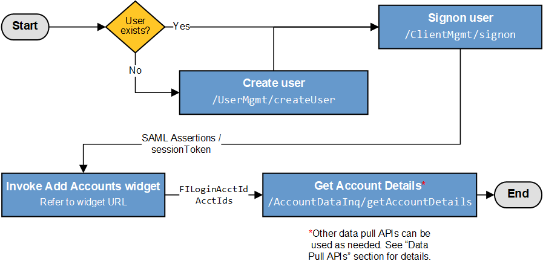

By default, the Add Accounts widget displays an Account Classification and Confirmation page. If your implementation disables this page and is configured in such a way that Add Accounts returns control back to you after accounts are pulled from the FI, use the following flow where you need to confirm whether the harvesting was successful and whether detailed harvesting for retrieving account details is complete.

**Add Accounts Widget Invocation Process when Account Add Confirmation is not configured:**

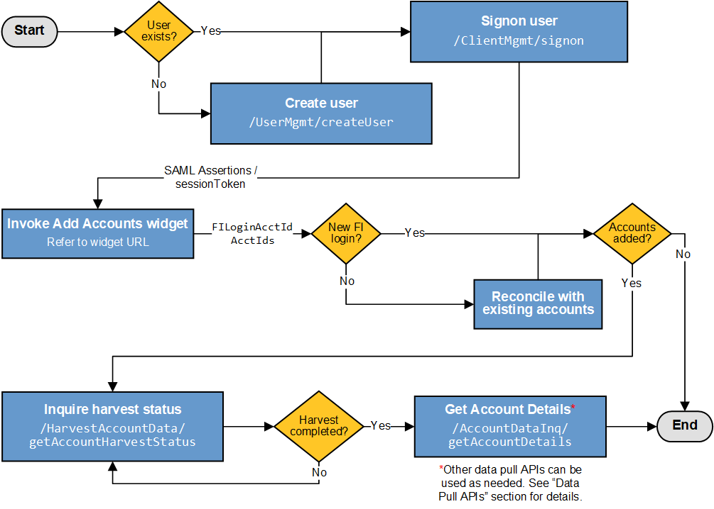

### Widget URL

Access the Add Account widget in the partner integration environment with the following URL.

&lt;Domain URL&gt;PFM_UI/widgets/base/addaccounts/addAccountsWidget.iface

…with the mandatory POST parameter &quot;sessionToken=&lt;sessionToken&gt;&quot; and any optional parameters required for the scenario

The partner integration team provides the production URL.

- **Parameters required for invocation:** The required parameters for Add Accounts widget are **sessionToken** and **return\_url**. It is recommended that you send the **keepalive\_url** and **error\_url**.
- **Parameters on return:** Add Accounts widget will invoke **return\_url** , with **FILoginAcctId** and **AcctId** parameters.
- **Error conditions**: Add Accounts widget handles any harvesting errors in interactive manner unless the user closes the widget prematurely.

### Data Pull APIs

By default, when the Add Accounts widget has completed its flow successfully, the harvesting engine would have completed pulling relevant account information for all the added accounts. This includes account summary information, transactions, and any investment positions. This harvested data is made available through data pull APIs such as _AccountDataInq/getAccountDetails_. Refer to the AllData Web Services API Specifications Guide provided for more details.

If the Account Classification and Confirmation screens are disabled, the widget returns control back when it finds some accounts at the FI. Then a back-end process starts harvesting the newly added accounts for more details. It is recommended that you keep polling the harvest status using _getAccountUpdateSummary_ / AccountUpdateSummaryRq API until the harvesting is complete, and then invoke the data pull APIs. The _getAccountUpdateSummary_ / AccountUpdateSummaryRq API uses this request ID to pull information about ongoing harvest run. You can use Fiserv provided user ID as input parameter for the _getAccountUpdateSummary_ / AccountUpdateSummaryRq API.

| Web service name  |  Update status check |
|---|---|
| Resource URL  | &lt;FiservWSUrl&gt;/AccountDataInq/getAccountUpdateSummary  |
| Description  |  This API is used to get the account refresh status after the accounts are added using add accounts widget |
  | API Explorer Link  | [getAccountUpdateSummary](../api/?type=post&path=/WealthManagementWeb/ws/AccountDataInq/getAccountUpdateSummary)  |

### Frequently Asked Questions

The following are some frequently asked questions on how the Add Accounts widget works.

1. What information is sent back on **return_url**?

Add Accounts widget invokes **return\_url** after its processing is complete and sends the newly added login account ID at the FI ( **FILoginAcctId** ) as well as account IDs for all the accounts added in this widget session. These accounts are listed in comma-separated values with param **AcctId**.

2. What happens if the user selects an FI that is already registered and gives the same credentials?

The Add Accounts widget recognizes that this set of credentials for the chosen FI is already stored and initiates the Add More Accounts process. A harvesting attempt is made to find more accounts at the FI that can be added for aggregation. Any newfound accounts will be added using a similarly configured process as the original request, such as taking into account specific screens enabled using home-level configuration parameters. If the **return\_url** parameter exists, it will be invoked with the corresponding **FILoginAcctId** and a comma-separated list of all accounts.

3. What happens if the user chooses an FI that is already registered, provides same user credentials, and there are no new accounts found?

- If the **return\_url** parameter exists, it is invoked with existing **FILoginAcctId** and existing **AcctIds**.
- If **return\_url** is not set, the Add Accounts widget shows a message that no new accounts were found.

**Message when no new accounts found:**

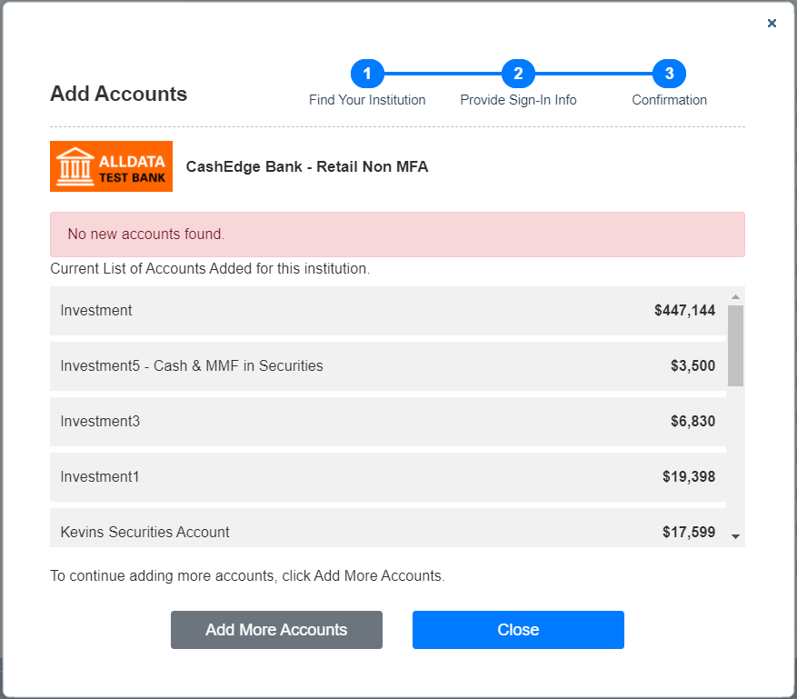

4. What error conditions are possible?

The Add Accounts widget handles any harvesting errors interactively unless the user closes the widget prematurely. In such a case, there may be harvesting errors that will be made available through the data pull APIs. If the user chooses same FI and provides same user ID, the Add Accounts widget resumes previous attempt and presents the existing error to the user.

## Alert Resolution Widget

### Alert Resolution Widget Overview

The Alert Resolution widget allows partners to take advantage of a library of screens that walk users through errors they may encounter during the account harvesting process. If an account is in error, the Alert Resolution widget will identify the correct alert resolution screens to display for the corresponding account. The widget screens will inform the user of the issue preventing aggregation from functioning correctly and guide the user through any steps required to resolve the error. Refer to [Appendix A – Harvesting Alert Error Resolution Screens](?path=/docs/alldata-next-gen/appendices.md#appendix-a) for error content and workflows.

**Alert Resolution widget:**

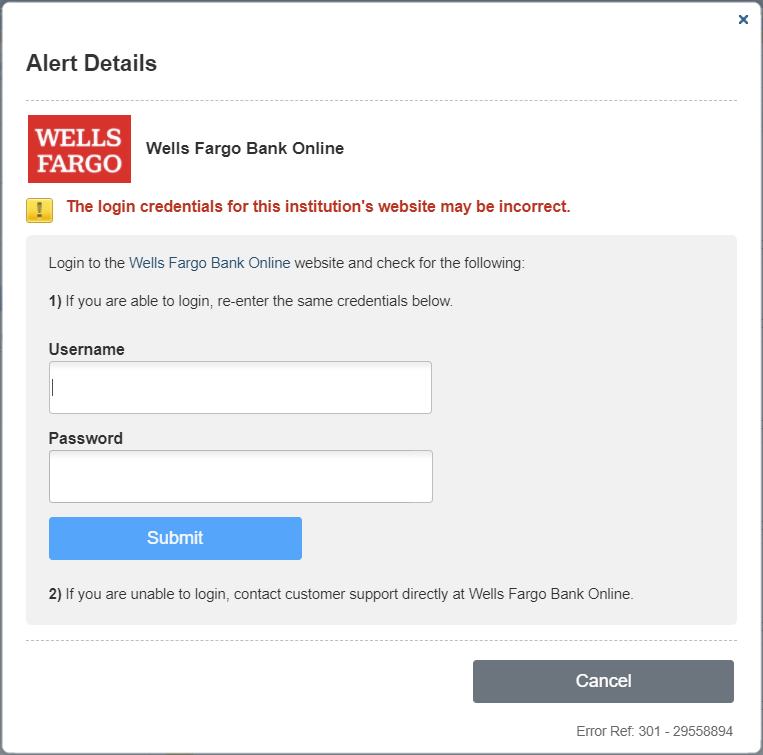

### Alert Resolution Widget Integration Options

Partners have multiple options for exposing the Alert Resolution widget screens to their users:

**Integrated to the Account Management widget** – In addition to other maintenance functionality that is included in the Account Management widget (like deleting FIs/accounts, adding more accounts, and so on), the Alert Resolution widget is integrated directly into the Account Management widget. From the Account Management widget, the user will see the accounts that are in error state and launch the Alert Resolution widget to address the error.

**Alert Resolution widget through Account Management widget:**

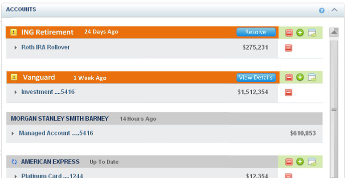

**Integrated to the Alerts Listing widget** – The Alert Listing widget provides an inventory of accounts that are associated with outstanding alerts. From the Alert Listing widget, users can access the corresponding Alert Resolution widget to address the errors.

**Alert Resolution widget through Alert Listing widget:**

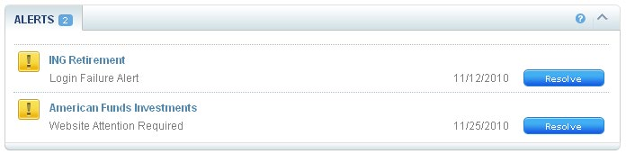

**Integrate Alert Resolution widget** – The Alert Resolution widget can be embedded and launched directly from the appropriate locations on partner application screens at the account level. Partners wishing to use their own account listing screens may choose to identify outstanding alerts in their own screens.

**Alert Resolution widget through partner UI:**

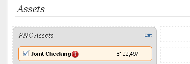

When a user attempts to resolve the alert, the partner application will call the Alert Resolution widget URL and provide the necessary identifiers for the respective account ( **FILoginAcctId** and/or **AcctId** ). The Alert Resolution widget will identify the associated error and display the necessary screens to resolve it.

### Alert Resolution Screens CSS Definition

##### Primary CSS Classes

The following table provides an inventory of the primary CSS classes that control the look and formatting of the Alert Resolution widget screens:

|#|CSS class|Description|CSS parameter and default value|
|--- |--- |--- |--- |
|1|Background color|This parameter controls the background color that obscures the main screen when the Add Accounts screen overlays are activated.|.wrapper { &nbsp;&nbsp;background: #fff; &nbsp;&nbsp;margin: 15px 0; }|
|2|Widget screen header|This parameter controls the font style of the main header of the Add Accounts screen overlays.|h1.main { &nbsp;&nbsp;font-size: 20px; &nbsp;&nbsp;font-weight: 600; &nbsp;&nbsp;line-height: 28px; &nbsp;&nbsp;align-items: center; &nbsp;&nbsp;display: flex; &nbsp;&nbsp;color: #333; &nbsp;&nbsp;margin-bottom: 5px; }|
|3|Gray color button|This parameter controls the color of the button on the Add Accounts screen.|.btn-secondary { &nbsp;&nbsp;color: #fff; &nbsp;&nbsp;background-color: #6c757d; &nbsp;&nbsp;border-color: #6c757d; }|
|4|Blue color button|This parameter controls the color of the button on the Add Accounts screen.|.btn-primary { &nbsp;&nbsp;color: #fff; &nbsp;&nbsp;background-color: #007bff; &nbsp;&nbsp;border-color: #007bff; }|
|5|Error header|This parameter controls the font style of the error header on the Add Accounts screen.|.alert_redtext { &nbsp;&nbsp;background:url(../images/icons/alerts.png) no-repeat 5px 0px; &nbsp;&nbsp;font-size:1.15em; &nbsp;&nbsp;color:#b83320; &nbsp;&nbsp;padding:5px 0 10px 40px;  &nbsp;&nbsp;margin:8px 0px; &nbsp;&nbsp;font-weight:bold; }|

### Images

All images and icons in the Alert Resolution widget are configurable. The URLs where each of the images are retrieved from are configured in the Widget CSS file.

|#|Default image|Description|CSS parameter and default values|Default size|
|--- |--- |--- |--- |--- |
|1|

|Large alert icon|.alert_redtext { &nbsp;&nbsp;background:url(../images/icons/alerts.png) no-repeat 5px 0px; &nbsp;&nbsp;font-size:1.15em; &nbsp;&nbsp;color:#b83320;  &nbsp;&nbsp;padding:0px 0px 10px 40px; &nbsp;&nbsp;margin:8px 0px; &nbsp;&nbsp;font-weight:normal; }|23x23|
|2|
|Eye icon|.eyeIcon { &nbsp;&nbsp;background: #fff; &nbsp;&nbsp;border: 1px solid #bebebe; &nbsp;&nbsp;cursor: pointer; &nbsp;&nbsp;border-left: 0px; }||
|3|
|Lock icon|.urlLink { &nbsp;&nbsp;display: flex; &nbsp;&nbsp;line-height: 24px; &nbsp;&nbsp;margin-bottom: 15px; }||
|4|
|Close window icon|.cboxClose{ &nbsp;&nbsp;float:right; &nbsp;&nbsp;background:url(../images/celightbox/button_close.png) top right no-repeat; &nbsp;&nbsp;width:8px; &nbsp;&nbsp;height:8px; &nbsp;&nbsp;display:block; &nbsp;&nbsp;margin:-10px -10px; &nbsp;&nbsp;margin:5px; &nbsp;&nbsp;cursor: pointer; }|10x10|

### Text Configuration via Resource Bundles

AllData widgets use resource bundles to persist most of the text that is displayed to users in the widget screens. This allows partners to customize the language and content to meet their business requirements. The following section describes the configurable text in the screens used by the Error Resolution widget.

Error Resolution widget screens have two basic formats: Either no user action is required, or the user can choose an action.

1. **No user action required**

Partners can customize the following elements:

- Error message text based on error code
- Body content

**Error Resolution widget customization screen:**

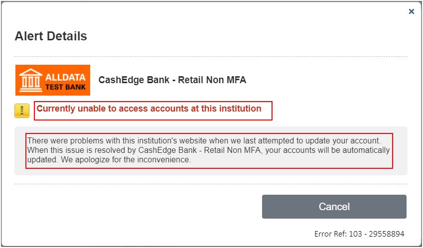

2. **The user can choose an action**

Partners can customize the following elements:

- Error message text based on error code
- Subheading text
- Text for options
- Text guiding the user to customer support and customer support link
- Enable/disable **Remove Account** button
- Label and style of **Cancel** button

**Error Resolution widget customization screen:**

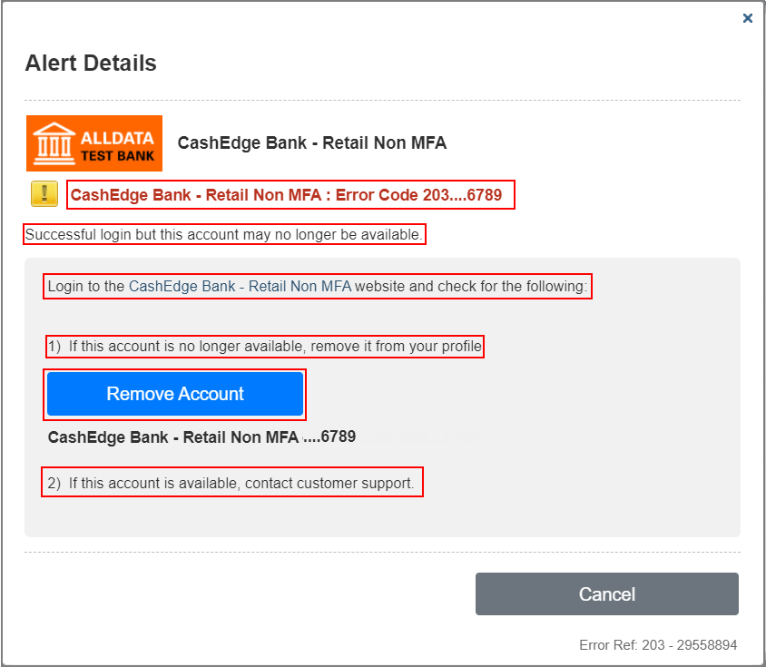

### Widget Invocation

The following process diagram explains the web services APIs the partner calls before and after the invocation of the Error Resolution widget.

**Error Resolution widget invocation process diagram:**

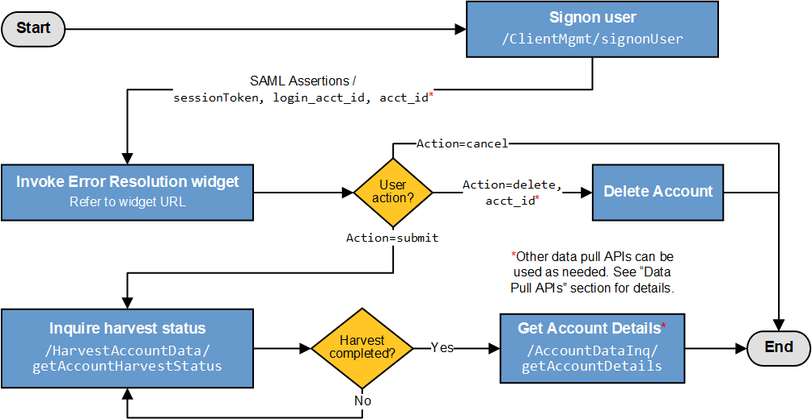

### Widget URL

The Alert Resolution widget can be accessed using following URL for the partner integration environment. The production URL will be provided later by the partner integration team.

Alert Resolution widget URL for partner integration environment is:

&lt;Domain URL&gt;PFM\_UI/widgets/base/addaccounts/alerts/resolveAlertWidget.iface

…with the mandatory POST parameter &quot;sessionToken=&lt;sessionToken&gt;&quot; and any optional parameters for the scenario

- **Parameters required for invocation:** For Error Resolution widget apart from **sessionToken** , the other required parameters are **login\_acct\_id** and/or **acct\_id**. When both these parameters are sent, the widget first looks at account level errors and if there are none, it uses the **login\_acct\_id** to check for errors present at that level. Invoking this widget also requires the **return\_url** parameter. It is recommended that you send the **keepalive\_url** and **error\_url**.
- **Parameters on return:** The Error Resolution widget will invoke **return\_url** with action parameter that will indicate whether the user merely cancelled out of the widget or did take some action to mitigate the error. The possible values are &quot;Cancel,&quot; &quot;Deleted,&quot; and &quot;Submit.&quot; If the error resolution results in adding accounts to the **login\_acct\_id** , the newly added **acct\_id** s are returned as list of comma-separated values along with the **login\_acct\_id**.
- **Error conditions:** In case there are processing errors, the Error Resolution widget invokes **error\_url** sent on the request. If **error\_url** is absent, the Error Resolution widget displays a message for the user. The following are the possible error conditions.

  - **Missing Required Parameters:** The invocation request does not have the required parameters present. (Error code 500)
  - **Invalid Parameter Passed:** When passing invalid **login\_acct\_id** or **acct\_id** during widget invocation. (Error code 510)
  - **System Error:** There was a processing error or invalid parameters were sent. (Error code 520)

### Data Pull APIs

There are multiple outcomes of an Error Resolution widget invocation:

1. The user chose to cancel out of widget or there was no user action possible for the error condition. In this case, the **action** parameter will have value &quot;Cancel&quot; and no further action is required from the partner. If the error persists beyond stated resolution time, you may have to contact Fiserv customer service.

2. The user chose to act on the error by deleting the account. In this case, the **action** parameter will have value &quot;Deleted.&quot; The partner is expected to use data pull APIs to sync up the accounts for that user.

3. The user chose to provide additional information to resolve the error. In this case the **action** parameter will have value &quot;Submit.&quot; The partner is expected to poll for completion of harvesting by checking the harvest status using _getAccountHarvestStatus_ / AccountHarvestStsInqRq API and then using data pull APIs to find out if the error resolution was successful.

### Frequently Asked Questions

The following are some of the frequently asked questions about how the Add Accounts widget works.

1. What information is sent back on **return\_url**?

The Error Resolution widget invokes **return\_url** after its processing is complete with the **action** parameter. If the error resolution results in adding more accounts, the newly added account IDs are sent as a list of comma-separated values with **AcctId** parameter along with the **FILoginAcctId**.

2. When is harvesting triggered in the Error Resolution flow?

The following error codes trigger a harvesting update when resolved: 300, 301, 302, 303, 304, 307, and 201 (if the user chooses to match up the accounts retrieved from FI). This harvested data is made available through data pull APIs. Please refer to the AllData XML/Web Services Specifications Guide provided for more details.

On the similar lines to that of Add Accounts flow, it is recommended that you keep polling the harvest status using _getAccountHarvestStatus_ / AccountHarvestStsInqRq API until the harvesting is complete before invoking the data pull APIs. The **FILoginAcctId** of the newly added login account is sent back as a parameter to the **return\_url**. The _getAccountHarvestStatus_ / AccountHarvestStsInqRq API uses this **FILoginAcctId** to pull information about the ongoing harvest run.

3. When does the Error Resolution widget invoke the Add More Accounts flow?

If the user had stopped the Add Accounts flow with FI login-level harvesting errors, there will be no child accounts present for that parent FI login account. If the user tries to resolve such a harvesting error, the harvesting update gets triggered as if the user is trying to add more accounts from that FI. The newly added accounts information will be sent back on the **return\_url** as discussed in question 2.

4. How do we know if the error was resolved successfully?

When the user submits the information such as new credentials, to resolve the error, the Error Resolution widget notes that and triggers backend harvesting. The success of that attempt cannot be known until harvesting completes. We recommend that you keep polling the status for harvest completion and check the information using data pull APIs.

5. Could there be multiple errors with the same account?

It is possible that there are multiple errors or even errors at multiple levels: FI level, FI login account level, and account level. Resolving errors at high levels in the hierarchy (such as by our scripting team) may uncover other errors. After an error resolution action is taken, you should use data pull APIs to check for further errors.

## Account Management Widget

### Ordering FIs/Accounts

The Account Management widget provides a list screen of the FIs (parent CFIs) and accounts (child CFIs) that are associated with the user. The Account Management widget allows the user to add more, edit, delete, and resolve alerts for FIs/accounts. Upon completion of a session, Fiserv recommends that the partner retrieve all the active accounts for the user since the user can modify multiple accounts belonging to multiple parent FIs in a given session.

The Account Management widget groups accounts by associated FI (parent CFI). The FIs will generally be listed alphabetically. If an FI has multiple accounts (child CFIs), the accounts will be listed alphabetically below the FI. There are exceptions to the standard sorting order:

- Any institutions/accounts with harvesting errors appear at the top of the widget.
- If there are host accounts at the partner FI, it will be promoted to the top of the Account Management widget, below harvesting errors and above external accounts.
- If there are offline accounts, those FIs/accounts will be listed last.

**Account Management widget:**

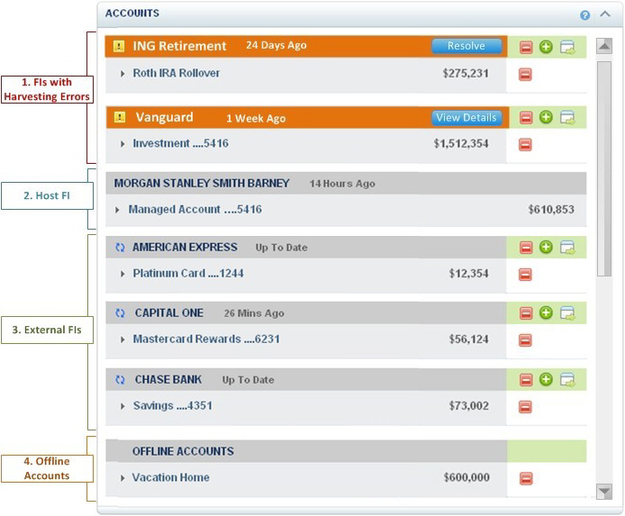

### Resolve Alerts

Users can access the appropriate harvesting alert resolution screens from the Account Management widget. When an account has a harvesting alert, the FI is ordered ahead of other FIs, the FI row displays a different color to differentiate it. A **Resolve** button is displayed in the associated FI row of the Account Management widget if the harvesting error has occurred at parent CFI level and if the error has occurred at account level, the **Resolve** button is placed at the account level.

When the **Resolve** button is clicked, a corresponding alert resolution screen displays as an overlay.

**Resolve Alerts Screen – Account Management widget:**

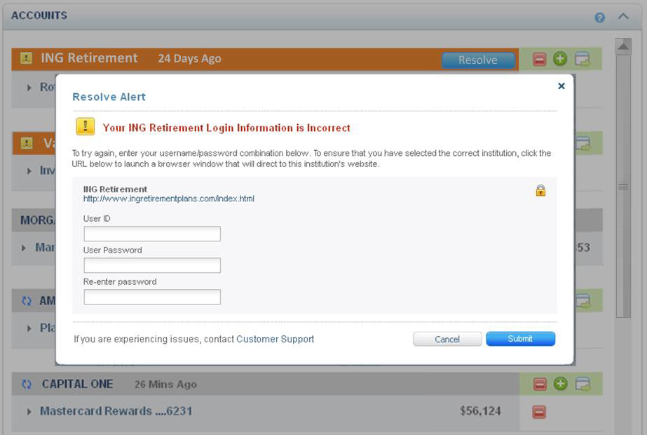

For information on the content and flow of the alert resolution screens, see [Appendix A – Alert Resolution Screens](?path=/docs/alldata-next-gen/appendices.md#appendix-a).

For alerts that the user can resolve, the action button is labeled &quot;Resolve.&quot; For other alerts, which require Fiserv or FI intervention to resolve, the button label is &quot;View Details.&quot;

After the user follows the necessary instructions in the Resolve Alert panel and clicks **Submit** , if another harvest is required to validate the resolution, the Resolve Alert panel vanishes, and a progress bar appears in place of the **Resolve** button. The progress bar displays until the harvest is complete.

**Resolve Alerts progress bar:**

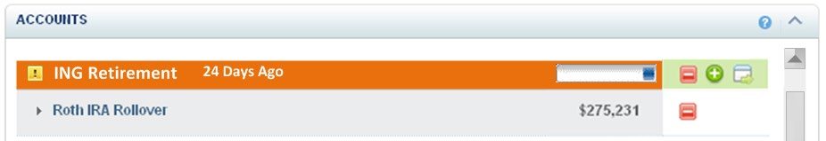

After the harvest completes, if the alert is resolved, a confirmation message displays temporarily to inform the user that the alert was successfully resolved. After a few seconds, the FI row reverts to its default color and the FI is re-ordered to its usual alphabetic place relative to the other FIs.

**Resolve Alerts Confirmation message:**

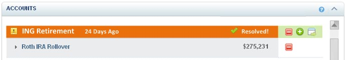

### Manual Account Update

External accounts that do not have harvesting alerts associated with them allow the user to manual initiate a harvest to retrieve the latest account data. A refresh icon is displayed next to the FI name that allows the user to initiate the manual account update. When the update is underway, the refresh icon animates to indicate that it is processing. Once the update completes, the latest account balance is displayed for the associated accounts and the timestamp in the FI row is updated accordingly.

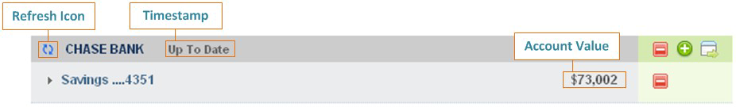

### Add More Accounts

The Add More Accounts button initiates the process to identify additional accounts (child CFIs) with the previously submitted login credentials at a financial institution (parent CFI). The Add Accounts widget displays an overlay screen showing the progress of the harvest attempt.

**Add More Accounts progress screen:**

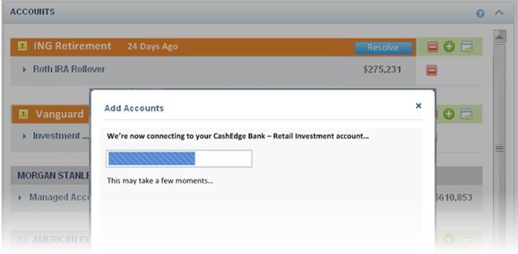

If additional accounts are identified, they are automatically added to the user&#39;s profile. If none are identified, a message indicates this in the user&#39;s list of current accounts.

**Add More Accounts message screen:**

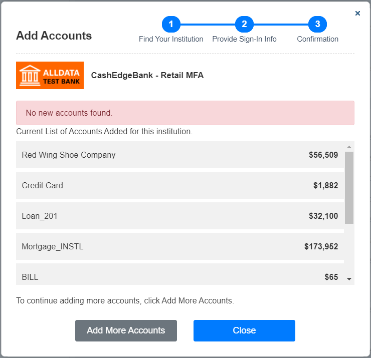

### Delete FI/Accounts

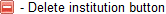

For each parent CFI, a &quot;delete institution&quot; button is available that allows the user to remove the institution and all associated accounts. After clicking the button, a confirmation button appears that allows the user to confirm or cancel the action.

**Delete institution confirmation message:**

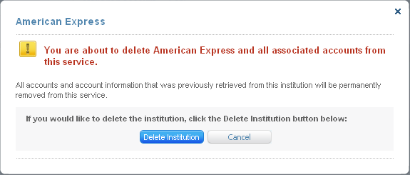

##### Delete Account

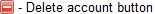

For each child CFI, a &quot;delete account&quot; button is available that allows the user to remove the account from the parent CFI and no additional child CFIs. After clicking the button, a confirmation button appears that allows the user to confirm or cancel the action.

**Delete account confirmation message:**

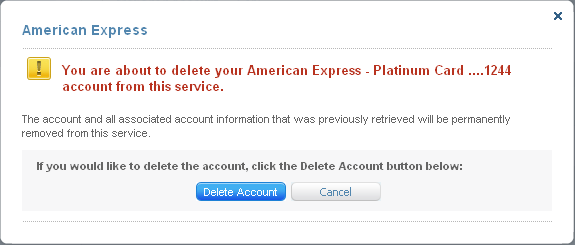

### Log in to FI Site

For each parent CFI, there is a &quot;log in to financial institution&quot; button that launches another browser tab/window and navigate to the selected financial institutions login screen so that the user can submit their credentials to log in to the FI site.

### Editable Account Attributes

Managed account entries are not editable. The account name, account type, and amount are imported to the AllData database via batch/API.

**Managed account entry in Accounts module:**

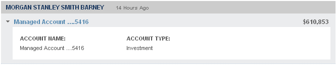

Users can edit the nicknames and account types of their held away accounts. A &quot;refresh&quot; button is also available. Account types use the Account Type Name lookup to identify partner-defined account type names for the accounts.

**Held Away account entry in Accounts module:**

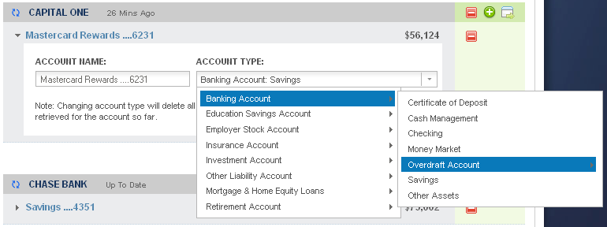

Users can edit the account nickname, change asset type, modify the amount value, and delete offline accounts.

**Offline Accounts:**

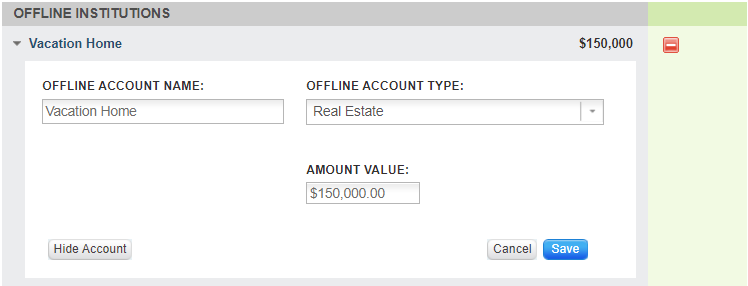

### Configurable Dimensions

The Account Management widget includes configurable dimensions for partners to select the desired width and height for the widget. If the content does not fit within the allotted dimensions, scroll bars appear automatically.

**Account Management widget with vertical scroll:**

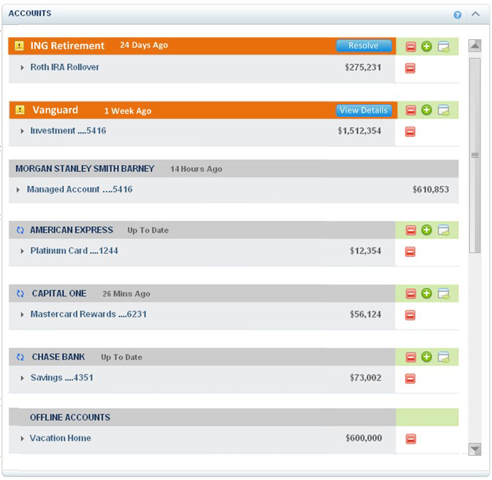

### Widget URL

Access the Account Management widget in the partner integration environment with the following URL.

&lt;Domain URL&gt;PFM\_UI/widgets/base/accounts/accountsManagementWidget.iface

…with the mandatory POST parameter &quot;sessionToken=&lt;sessionToken&gt;&quot; and any optional parameters required for the scenario

The production URL will be provided later by the partner integration team.

## Your Progress Widget

### Your Progress Widget Overview

The Your Progress widget acts as a prompt to encourage the user to add accounts to their profile. The widget tracks the number of accounts and account categories that are associated to the profile.

**Your Progress widget – Incomplete:**

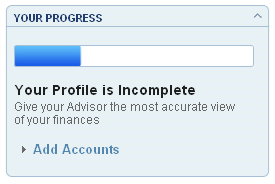

The progress bar represents the state of the user&#39;s accounts as compared to a standard definition of a complete account portfolio. The progress bar is split into ninths. As the user adds accounts (or indicates not owning that type of an account), the progress bar moves 1/9th closer to completion. When completed, the message displayed changes.

**Your Progress widget – Complete:**

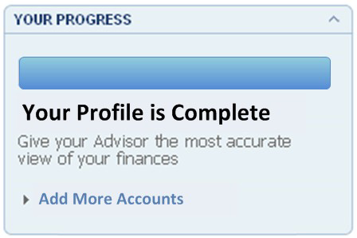

By default, the Your Progress widget shows the progress bar for the user with the account categories collapsed. When expanded, the widget reveals the different account categories along with status of the user&#39;s accounts as compared to those account categories.

**Your Progress widget – Expanded:**

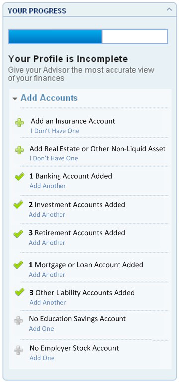

Account categories in the Your Progress widget have three possible states. The following table describes each state and shows the icon that indicates it.

|Account category state|Icon|Description|
|--- |--- |--- |
|Undetermined|

|Default state of the account categories. This indicates that the user has not added an account of this category and has not indicated that one is unavailable. Account categories in this state are sorted to the top of the module. Clicking the icon or the main text launches the Add Account screens. Clicking the “I Don’t Have One” sub text moves the category into None state.|
|Added|

|One or more accounts have been added to the account category. Account categories in this state are sorted behind the Undetermined account categories. Clicking the “Add Another” sub text launches the Add Account screens.|
|None|

|User has indicated that they do not own accounts in this category. Progress for the user is increased as if an account has been added in this category. Account categories in this state are sorted to the bottom of the Your Progress widget. Clicking the Add One link launches the Add Account screens.|

The standard profile of progress categories is configurable at the home level. A variable number of categories can be configured for a home. For each category, a variable number of extended account types or instruments can be assigned. When a user adds an account, the application identifies the extended account type or instrument of the new account to determine which category it belongs to. If an account has an extended account type and instrument type assigned, the instrument type takes precedence in determining the account category.

The following table describes the eight default categories and associated extended account types/instruments:

| Account category               | Account type              | Account type code | Extended account type code |
|--------------------------------|---------------------------|-------------------|----------------------------|
| Banking                        | Certificate of Deposit    | OAA               | CDA                        |
|                                | Cash Management           | DDA               | CMA                        |
|                                | Checking                  | DDA               | DDA                        |
|                                | Money Market              | SDA               | MMA                        |
|                                | Savings                   | SDA               | SDA                        |
| Education savings              | 529 / Education Savings   | INV               | INV                        |
| Bill                           | Billing                   | BPA               | BPA                        |
|                                | Landline Phone            | BPA               | LLP                        |
|                                | Streaming Media           | BPA               | SMA                        |
|                                | Mobile Phone              | BPA               | MBL                        |
|                                | Internet                  | BPA               | INT                        |
|                                | Cable/Satellite TV        | BPA               | CBL                        |
| Insurance                      | Annuity                   | INS               | ALI                        |
|                                | Term Life                 | INS               | TLI                        |
|                                | Universal Life            | INS               | ULI                        |
|                                | Whole Life                | INS               | WLI                        |
| Investment                     | GIC/Term Investment (GIC) | OAA               | GIC                        |
|                                | Brokerage                 | INV               | INV                        |
| Other liabilities              | Credit Card               | CCA               | CCA                        |
|                                | Loan                      | OLA               | ILA                        |
|                                | Auto Loan                 | OLA               | ILC                        |
|                                | Investment Loan           | OLA               | ILI                        |
|                                | Student Loan              | OLA               | ILS                        |
|                                | Line of Credit            | OLA               | LOC                        |
|                                | Other Liability           | OLA               | OLA                        |
| Mortgage and home equity loans | Mortgage                  | OLA               | MLA                        |
|                                | Home Equity Loan          | OLA               | MLA                        |
| Retirement                     | 401 (k)                   | INV               | INV                        |
|                                | 403 (b)                   | INV               | INV                        |
|                                | 457                       | INV               | INV                        |
|                                | Deferred Comp Plan        | INV               | INV                        |
|                                | KEOGH                     | INV               | INV                        |
|                                | Pension                   | INV               | INV                        |
|                                | Profit Sharing Plan       | INV               | INV                        |
|                                | IRA                       | INV               | INV                        |
|                                | IRA – Roth                | INV               | INV                        |
|                                | IRA – Rollover            | INV               | INV                        |
|                                | IRA – Sep                 | INV               | INV                        |
|                                | IRA – Simple              | INV               | INV                        |

After the appropriate category is identified, the category in the Your Progress widget is updated to reflect the new account has been associated to the user profile.

The progress bar calculates the percentage that each category represents by dividing 100 by the number of configured categories.

The user may select &quot;I Don&#39;t Have One&quot; for any account category that does not have an account associated with it. This acts as a surrogate for that account category and moves the progress bar forward. The user can still add accounts to these account categories if desired.

### Text Configuration via Resource Bundles

AllData widgets use resource bundles to persist most of the text that is displayed to users in the widget screens. This allows partners to customize the language and content to meet their business requirements. All the text elements that are used in the Your Progress widget are configurable. Partners wishing to change the text for any of the elements can send the replacement text to the project manager to include them in the partner home&#39;s resource bundle.

### CSS Definition

The CSS for Your Progress widget is the same as Add Accounts widget. The fonts and colors used in this widget can be modified using the same [CSS definitions](#add-account-screens-css-definition) as in Add Accounts widget.

### Widget URL

Access the Your Progress widget in the partner integration environment with the following URL.

&lt;Domain URL&gt;/PFM\_UI/widgets/base/accounts/progressSnapshot.iface

…with the mandatory POST parameter &quot;sessionToken=&lt;sessionToken&gt;&quot; and any optional parameters required for the scenario

The production URL will be provided later by the partner integration team.

##### Parameters required for invocation:

The required parameters are same as for Add Accounts widget ( **sessionToken** and **return\_url** ) though it is recommended that you send the **keepalive\_url** and **error\_url**.

This widget is typically embedded within the application page, such as a dashboard, and does not come with ways to close it or log out of it.

## Return Scenarios

### Return URL scenarios

The following table provides details on different use case scenarios in which AllData returns control back to the partner application by calling the **return\_url** that the partner shares. It includes whether the scenario has an account confirmation page and details of the parameters and parameter values sent along with **return\_url**.

| Widget/ implementation     | Scenario                                                                                                                                                                                                                                                                                           | Acct conf pg? | Parameter name(s)     | Parameter value(s)   | Other param(s)        |
|----------------------------|----------------------------------------------------------------------------------------------------------------------------------------------------------------------------------------------------------------------------------------------------------------------------------------------------|---------------|-----------------------|----------------------|-----------------------|
| Add Account                | When accounts are added                                                                                                                                                                                                                                                                            | No            | AcctId, FILoginAcctId | &lt;account IDs&gt;        |                       |
| Add Account                | After adding accounts, widget close action in confirmation page                                                                                                                                                                                                                                    | Yes           | Action                | Close                |                       |
| Add Account                | No accounts found in FI to add                                                                                                                                                                                                                                                                     | No            | Action                | NoNewAccountsFound   |                       |
| Add Account                | On Add More Accounts, all the accounts are already added and there are no new accounts in FI to add.                                                                                                                                                                                               | No            | Action                | NoNewAccountsAdded   |                       |
| Add Account                | On Add More Accounts, one or more of the user’s existing accounts was not found at the FI. The user must resolve this error prior to adding more accounts.                                                                                                                                         | No            | Action                | NoAccountsAdded      |                       |
| Add Account                | On passing invalid PartnerAppID (unregistered partner app ID) – primarily required when adding OAuth FIs                                                                                                                                                                                           | N/A           | Action                | Close                | errorCode= 3005       |
| Add Account – deep linking | When accounts are added                                                                                                                                                                                                                                                                            | No            | AcctId, FILoginAcctId | &lt;account IDs&gt;        |                       |
| Add Account – deep linking | After adding accounts, closing the widget from the confirmation page                                                                                                                                                                                                                               | Yes           | Action                | Close                |                       |
| Add Account – deep linking | No accounts found in FI to add                                                                                                                                                                                                                                                                     | No            | Action                | NoNewAccountsFound   |                       |
| Add Account – deep linking | On Add More Accounts, all the accounts are already added and there are no new accounts in FI to add.                                                                                                                                                                                               | No            | Action                | NoNewAccountsAdded   |                       |
| Add Account – deep linking | On Add More Accounts, one or more of the user’s existing accounts was not found at the FI. The user must resolve this error prior to adding more accounts.                                                                                                                                         | No            | Action                | NoAccountsAdded      |                       |
| Add Account – deep linking | On passing invalid FI ID in widget invocation                                                                                                                                                                                                                                                      | N/A           | Action                | Close                | errorCode= 3001       |
| Add Account – deep linking | On passing invalid FI account ID in widget invocation                                                                                                                                                                                                                                              | N/A           | Action                | Close                | errorCode= 3002       |
| Add Account – deep linking | On passing an empty account ID and an invalid or empty FI ID in widget invocation                                                                                                                                                                                                                  | N/A           | Action                | Close                | errorCode= 3001, 3002 |
| Add Account – deep linking | When the Add process is successful and no accounts are returned – on clicking Start Over in the widget, return_url is invoked with this Action and errorCode                                                                                                                                       | Yes           | Action                | Cancel               | errorCode= 3003       |
| Add Account – deep linking | On passing invalid PartnerAppID (unregistered partner app ID) – primarily required when adding OAuth FIs                                                                                                                                                                                           | N/A           | Action                | Close                | errorCode= 3005       |
| Alert Resolution           | All user intervention scenarios in Resolve Alerts after taking action to resolve error and submit, such as after updating login credentials, editing MFA answers, and changing account types (Child Accounts available)                                                                            | N/A           | Action                | Submit               |                       |
| Alert Resolution           | All user intervention scenarios in Resolve Alerts after taking action to resolve error and submit, such as after updating login credentials and editing MFA answers (No Child Accounts available – Add process will be initiated).    After adding accounts, widget close action in confirmation page | Yes           | Action                | Close                |                       |
| Alert Resolution           | All user intervention scenarios in Resolve Alerts after taking action to resolve error and submit, such as after updating login credentials and editing MFA answers (No Child Accounts available – Add process will be initiated.    When accounts are added                                          | No            | AcctId, FILoginAcctId | &lt;account IDs&gt;        |                       |
| Alert Resolution           | User clicks Select New Institution in error 306 alert.                                                                                                                                                                                                                                             | N/A           | Action                | SelectNewInstitution |                       |
| Alert Resolution           | On passing invalid PartnerAppID (unregistered partner app ID) – primarily required when adding OAuth FIs                                                                                                                                                                                           | N/A           | Action                | Close                | errorCode= 3005       |
| All widgets                | On clicking Cancel or Close in any widget                                                                                                                                                                                                                                                          | N/A           | Action                | Cancel               |                       |

### Error URL scenarios

This table provides details on error scenarios during widget invocation in which AllData redirects users to the **error\_url** the partner shares, and error code details specific to each scenario in parameter values sent with the **error\_url**. None of the following scenarios require additional parameters.

| Widget/ implementation   | Scenarios                                                                                   | Parameter name | Parameter value(s)               | Type      |
|--------------------------|---------------------------------------------------------------------------------------------|----------------|----------------------------------|-----------|
| All widgets              | Session timeout                                                                             | errorCode      | 3000                             | Error URL |
| All widgets / invocation | When partner passes unregistered (not whitelisted with Fiserv) domain name in css_url       | errorCode      | 3010                             | Error URL |
| All widgets / invocation | When partner passes unregistered (not whitelisted with Fiserv) domain name in return_url    | errorCode      | 3011                             | Error URL |
| All widgets / invocation | When partner passes unregistered (not whitelisted with Fiserv) domain name in error_url     | errorCode      | 3012                             | Error URL |
| All widgets / invocation | When partner passes unregistered (not whitelisted with Fiserv) domain name in keepalive_url | errorCode      | 3013                             | Error URL |
| All widgets / invocation | When partner passes unregistered (not whitelisted with Fiserv) domain name in logout_url    | errorCode      | 3014                             | Error URL |
| All widgets / invocation | When partner passes unregistered (not whitelisted with Fiserv) domain name in offline_url   | errorCode      | 3015                             | Error URL |
| All widgets / invocation | When partner does not pass mandatory parameter in SSO request                               | errorMsg       | Missing Mandatory Params: Values | Error URL |
| Alert Resolution widget  | When the expected login_acct_id or acct_id is not passed during widget invocation           | errorCode      | 500                              | Error URL |
| Alert Resolution widget  | When passing invalid login_acct_id or acct_id during widget invocation                      | errorCode      | 510                              | Error URL |
| Alert Resolution widget  | System error – When an error internal to Fiserv occurs during widget invocation             | errorCode      | 520                              | Error URL |

### Scenarios applicable to SAML implementation

| Widget/ implementation   | Scenario                                 | Parameter name | Parameter value(s) | Type      |
|--------------------------|------------------------------------------|----------------|--------------------|-----------|
| All widgets / invocation | ssoSAML param user_id is missing         | errorCode      | SS2                | Error URL |
| All widgets / invocation | ssoSAML param home_id is missing         | errorCode      | SS39               | Error URL |
| All widgets / invocation | ssoSAML param partner_id is missing      | errorCode      | SS8                | Error URL |
| All widgets / invocation | ssoSAML param widget_id is missing       | errorCode      | SS40               | Error URL |
| All widgets / invocation | ssoSAML param invocation_mode is missing | errorCode      | SS41               | Error URL |
| All widgets / invocation | ssoSAML param return_url is missing      | errorCode      | SS42               | Error URL |

 
 

© 2020-2021 Fiserv, Inc. or its affiliates. All rights reserved. This work is confidential, and its use is strictly limited. Use is permitted only in accordance with the terms of the agreement under which it was furnished. Any other use, duplication, or dissemination without the prior written consent of Fiserv, Inc. or its affiliates is strictly prohibited. The information contained herein is subject to change without notice. Except as specified by the agreement under which the materials are furnished, Fiserv, Inc. and its affiliates do not accept any liabilities with respect to the information contained herein and are not responsible for any direct, indirect, special, consequential or exemplary damages resulting from the use of this information. No warranties, either express or implied, are granted or extended by this document.

[http://www.fiserv.com](http://www.fiserv.com/)

Fiserv is a registered trademark of Fiserv, Inc.

Other brands and their products are trademarks or registered trademarks of their respective holders and should be noted as such.

 
 

This document has been created by Fiserv and is classified **Fiserv Confidential**. This document is restricted to the received party and not to be forwarded or transferred without the approval of Fiserv.

