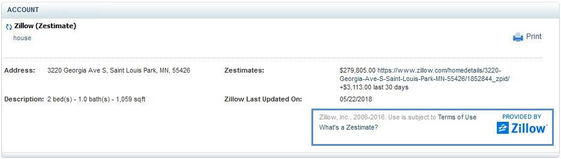

# Appendix A: API Error Codes

The following table lists all valid response status codes for the status aggregate defined earlier, their severities, their default text provided in the StatusDesc element, conditions that may trigger them, and, in some cases, information to help API partners resolve issues.

|Code|Severity|StatusDesc default text|Condition|Partner resolution action|
| --- | --- | --- | --- | --- |
| 0 | Info | Success | The service provider successfully processed the request. |
| 50 | Warning | Partial success | Partial success |
| 100 | Error | General Error | An error prevented the service provider from processing the transaction. No additional information is available. | If this error persists, please contact us with the CEUserID and timestamp. |
| 600 | Error | Unsupported message | The request received from the partner is not currently supported.
| 1020 | Error | Required element not included | Required element is missing in the request received from the partner. | Ensure API request provides all mandatory elements. Refer to Swagger documentation. |
| 1740 | Error | Authentication Failed | The customer could not be authenticated due to an incorrect HomeID, login ID, or password. | Verify the user login ID and password. |
| 2740 | Error | Invalid currency code | The currency code specified in the request is invalid.
| 4000 | Error | Invalid UserID | The UserID specified in the request is invalid.
| 4010 | Error | Invalid partnerID | The partnerID specified in the request is invalid.
| 4012 | Error | Invalid HomeID | The HomeID specified in the request is invalid.
| 4020 | Error | Invalid password | The password specified in the request is invalid.
| 4030 | Error | User already registered | The user identified by partnerID:HomeID:UserID is already registered with the server. |
| 4040 | Error | User not registered | The user identified by partnerID:HomeID:UserID is not registered with the server. |
| 4050 | Error | Invalid encryption scheme | The encryption scheme specified in the request is invalid.
| 4060 | Info | No data available | No data is available to satisfy the request. This could mean that the user has not registered any financial institutions, there are no transactions in the specified date range, and so on. | If this error occurs on invoking getAccountDetails API, it means user has not added any financial institutions. Confirm the user successfully added accounts under any financial institutions.If this error occurs on invoking transactions APIs, confirm the LastSuccessfulUpdate date is returned in getAccountDetails API for that specific account and the specified date range lies within the LastSuccessfulUpdate date. |
| 4070 | Error | Validation failure | One or more input fields were invalid. | Partner should make sure the mandatory parameters are sent in the request and in the defined format as in the corresponding Swagger documentation. |
| 4080 | Error | SessInfo creation failed | The Fiserv server was unable to create a SessInfo security token. | Reinvoke the signon API to get the new SessInfo token. If the error persists, please contact us with the CEUserID and timestamp. |
| 4090 | Error | Invalid SessInfo | The SessInfo token specified in the request is invalid. The session token is invalid or expired. | Generate a new SessInfo token and reinvoke the process flow with the new SessInfo token. If the error persists, please contact us with the CEUserID and timestamp. |
| 4100 | Error | Invalid FIAcctId | The FIAcctId specified in the request is invalid. |
| 4110 | Error | AcctType mismatch | The account specified in the request is not of the type specified in the request. | Verify AcctType of the accounts from getAccountDetails API response. |
| 4120 | Error | Not owner | The FILogin Account or FI Account for which a user is requesting details does not belong to the user. | The FILoginAcctId or AcctId sent by partner does not exist in the Fiserv system or the IDs belong to a different CEUserID in the system. |
| 4130 | Error | Invalid role | A sign-on has been attempted by a user in a role other than the authorized role. |
| 4140 | Error | Invalid FILoginAcctId | The FILoginAcctId specified in the request is invalid. |
| 4150 | Error | Invalid AcctType | The AcctType or ExtAcctType specified in the request is invalid. | Verify AcctType or ExtAcctType of the accounts from getAccountDetails API response. |
| 4210 | Error | Invalid XML Document | The request received from the partner site is not a valid XML document. |
| 4220 | Error | UserID unavailable | The UserID specified in the request is not available for registration. |
| 4240 | Error | UserDataPush failed | An attempt to push a user&#39;s data failed. |
| 4250 | Error | Invalid transaction type | The transaction type specified in the request is invalid. | Expected transaction type is Debit or Credit. Any other value returns this error. |
| 4260 | Error | Invalid date | The date specified in the request is invalid. |
| 4270 | Error | Invalid amount | The amount specified in the request is invalid. |
| 4280 | Error | Invalid search criterion | A search criterion specified in the request is invalid. |
| 4290 | Error | Invalid BroadcastMsgID. | The BroadcastMsgID specified in the request is invalid. |
| 4300 | Error | Account Already Exists | There was an attempt to add an account that already exists. | Do not send an AddNewAccounts request for a user with the same set of credentials in an FI. In case of an error with initial attempt with that set of credentials, refer to the [Harvester Error Codes](#appendix-b-harvester-error-codes) section of this document for information and resolution suggestions. |
| 4310 | Error | Harvesting Error | There was a harvesting error during the &quot;account add&quot; or &quot;add more accounts&quot; operation. | Research the returned UpdateErrorCode in the [Harvester Error Codes](#appendix-b-harvester-error-codes) section of this document for information and resolution suggestions. |
| 4320 | Error | FI Login Credentials Required | An &quot;add more account&quot; operation was attempted for a low-trust account without providing the login credentials. |
| 4322 | Error | Avoid gathering and sending User Credentials in OAuth FI | User credentials sent in the request for adding accounts in an OAuth-enabled FI. | Partner should refer to [Add Account workflow (OAuth)](./integrations.md#add-account-workflow-oauth) and follow the instructions when initiating add under an OAuth-enabled FI. |
| 4330 | Error | Invalid HarvestID | The harvest ID / run ID provided in the request is invalid. |
| 4332 | Error | Invalid OAuth Request ID | The OAuth request ID sent in the request is invalid. |
| 4333 | Error | Invalid Partner Application ID | The partner application ID is invalid. |
| 4335 | Error | Partner Application ID is required | Partner application ID is missing in the request. | Partner should ensure mandatory parameters are sent in the request. |
| 4336 | Error | OAuth configuration is required | There is an error in OAuth configuration. | If this error persists, please contact us with the CEUserID and timestamp. |
| 4350 | Error | Update in progress. | An update is already in progress. A new update (update or add) request cannot be submitted until the existing update is completed. | Allow the running update to complete before invoking update or add. |
| 4360 | Error | Incomplete Data for Request Completion. | The data provided for Request completion is not enough.Typically, this means insufficient data was provided for &quot;add new accounts,&quot; &quot;add more accounts,&quot; or &quot;account maintenance&quot; operations, and so on. |
| 4370 | Error | Invalid account classification attributes. | The account attributes combination required for account classification is invalid. <li>Instrument</li> <li>AccountOwnership</li> <li>RetirementStatus</li>| Please contact us with CEUserID and timestamp. |
| 4390 | Error | Invalid combination of FILoginAcctId and HarvestAddFetch(s) | Data contained in HarvestAddFetchAcctList does not match the FILoginAcctId. Especially created for the HarvestCreateAcctsRq. | Confirm the FILoginAcctId sent in the request is correct and consistent through the harvest add flow. |
| 4410 | Error | Invalid FIId | The FIId provided is not supported or does not exist in the database or the number provided is null or non-numerical. |
| 4420 | Error | Count of Accounts is high for this LoginAcctId | The number of accounts eligible for data pull submitted in AdvFILoginAcctInqRq is greater than the configured value. |
| 4430 | Error | No accounts found or accounts not eligible for update | The query criteria did not match with any accounts in the database eligible for update. | The updateAccounts API is invoked for a user with no eligible accounts to update. That is, all of the user&#39;s accounts have invalid credentials or they exist under suspended FIs.Confirm that the user has eligible accounts for update. |
| 4440 | Error | Duration is more than 3 days | The maximum duration allowed for deleted transactions API is three days. |
| 4450 | Error | No New Accounts | This is a warning message generated, when the harvest action during an &quot;account add&quot; or &quot;add more accounts&quot; operation was successful, but no new accounts were fetched from FI site. | This could be a scripting error or there could simply be no new accounts to add. |
| 4460 | Error | FI Login Credential exceed max length | Login credentials entered by user exceed the maximum length allowed at financial institution website. |
| 4470 | Error | The FI Login Account is suspended and cannot be updated. Please update the login information to resume aggregation activity. | When harvesting account login credentials are rejected, the Account Harvest Status (AcctHarvestStatus) is disabled. The FI Login Account Info List Inquiry Request (FILoginAcctInfoListInqRq) returns this error message in the response (FILoginAcctInfoListInqRs) to convey that the account is locked in the Fiserv system. | Correct the institution login credentials. |
| 4471 | Error | This account is at a financial institution that is not supported within this service. The account data will not be able to be refreshed/updated because support is now unavailable for this financial institution. | Received in the status aggregate when attempting to update an account or add more accounts to an FI that is suspended in Fiserv. | Inform customers that the FI is temporarily unavailable. |
| 4480 | Error | Invalid AcctId | The AcctId in the request does not match with any accounts for this user or is null. |
| 4510 | Error | Invalid Account Type Id | The account type id provided is invalid and does not exist in the database or is null. |
| 4530 | Error | Invalid Balance Type | The balance type provided is invalid. |
| 4540 | Error | Account Group specified in the request is invalid | The account group provided is invalid. Possible values are: Bill, Cash, Credit, Insurance, Investment, and Other |
| 4550 | Error | Invalid Date Range | The Start Date specified in the date range greater than current date. |
| 4551 | Error | Invalid date range. Modified date range returned no results. | Date range is a maximum of 90 days for all the transaction pull APIs except Deleted transactions API. No transactions are available in Fiserv for the modified date range. | The default maximum range is 90 days; this is configurable for partners requesting extended transaction history. |
| 4560 | Error | FI URL cannot be NULL | FI URL provided in the request is empty. FI URL is a mandatory field. |
| 4570 | Error | FI Name cannot be NULL | FI Name provided in the request is empty. FI Name is a mandatory field. |
| 4580 | Error | FI has already been requested and is under development | The Fiserv Data Operations team is already working on developing scripts for the requested FI. |
| 4590 | Error | FI is already supported | The requested FI is already supported. | Search for this FI or refresh the FI seed data. |
| 4591 | Error | No FIs found matching the search criteria provided | The FI search criteria provided did not match with any FIs in the database. |
| 4600 | Error | Request ID is required | Request ID (RqUID) is a mandatory field. Each request should have a unique request ID so partners can reconcile the responses they receive. |
| 4603 | Error | Person Name is required | PersonName aggregate is mandatory in PersonInfo aggregate. |
| 4604 | Error | First Name is required | FirstName is mandatory in PersonName aggregate. |
| 4605 | Error | Last Name is required | LastName is mandatory in PersonName aggregate. |
| 4615 | Error | E-Mail address passed in the request is invalid | The email address provided in the request is invalid. |
| 4620 | Error | UserProfile is required | UserProfile aggregate is mandatory if the partner home is configured. |
| 4621 | Error | PersonInfo is required | PersonInfo aggregate is mandatory if the partner home is configured. |
| 4622 | Error | Contact Info is required | Contact Info aggregate is mandatory if the partner home is configured. |
| 4623 | Error | Day Phone is required | DayPhone is mandatory if the partner home is configured. |
| 4624 | Error | Evening Phone is required | EveningPhone is mandatory if the partner home is configured. |
| 4625 | Error | Phone number has non-numeric data | DayPhone and/or EveningPhone provided are non-numerical. |
| 4626 | Error | Total phone numbers do not match allowed occurrence | Telephone numbers provided should not exceed the configured occurrence value. |
| 4627 | Error | Email Address is required | Email address is mandatory if the partner home is configured. |
| 4628 | Error | Invalid Email Address | The email address provided in the request is invalid. |
| 4629 | Error | Only one day phone value is allowed | DayPhone is provided more than once. |
| 4630 | Error | Only one evening phone value is allowed | EveningPhone is provided more than once. |
| 4710 | Error | User is locked | The requested user is locked in the Fiserv system. | Please contact us with the CEUserID. |
| 5012 | Error | Trust mode cannot be changed, as only high trust mode is allowed. | Trust mode cannot be changed if the partner home is configured for high-trust mode only. | Occurs when partners send other trust modes (low or medium trust) when editing the FI credentials. |
| 5013 | Error | Invalid AcctName | When creating or updating an offline account, an empty or null value was sent for account name element. |
| 7601 | Error | Transaction Not Found | There is no transaction with given criteria. | Verify the transaction ID sent in the request. |
| 7602 | Error | Category Not Found | The category provided does not exist in the Categorization Engine seed data. |
| 7603 | Error | Subcategory Not Found | The subcategory provided does not exist in the Categorization Engine seed data. |
| 7604 | Error | Subcategory label already exist | The user tried to add a category that already exists. |
| 7605 | Error | Not Processed | This error is related to category engine processing indicating that the transaction category update was not processed. |
| 7611 | Error | Request originated from an invalid IP address | Request originated from unknown (not whitelisted) IP address. | Contact Fiserv to whitelist any new IPs or make the request from whitelisted IPs. |
| 7613 | Error | Unsupported End Date, is lesser than 5 days from today | EndDt provided in AutoHarvestStsRq is less than 5 days from today. |
| 7701 | Error | This financial institution requires a multi-factor authentication process that is currently not enabled for this home | The FI requires an image-based multi-factor authentication that is currently not enabled for this home. Please contact Fiserv to enable it. |

# Appendix B: Harvester Error Codes

The following table lists and describes error codes returned as partof harvesting.

|Error code|Error|Message|Description|Partner resolution action|
| --- | --- | --- | --- | --- |
| 100 | Internal software error | Internal software error. Please try updating again in a few minutes. | Fiserv tried harvesting information from an institution but could not harvest the information successfully despite getting response from the institution. | Temporary issue: Partner should send HarvestAddRq/HarvestRq again. If it still fails, then it may be a harvesting error. Partner should report the issue to Fiserv after several unsuccessful retries.   These errors could be due to many reasons, such as FI server is busy or FI site is down. Retries usually resolve the problem. |
| 103 | Nonexistent URL or network failure. | Network failure. Please try updating again in a few minutes. | This is typically caused when there is a change in the hostname of the URL that is being accessed, but sometimes occurs due to temporary issues. | Temporary issue: Partner should send HarvestAddRq/HarvestRq again. If it still fails, then it may be a harvesting error. Partner should report the issue to Fiserv after several unsuccessful retries. |
| 104 | Time out error | We cannot establish a connection to your financial institution website at this time. Please try updating again in a few minutes. | Fiserv tried to connect to the institution where your account exists and was unable to reach the host institution due to network traffic. This is NOT a session timeout. When we fail to make a connection with the FI site after a few tries, it is classified as 104 error. | Temporary issue: Partner should send HarvestAddRq/HarvestRq again. If it still fails, then it may be a harvesting error. Partner should report the issue to Fiserv after several unsuccessful retries. |
| 105 | Target server error or server down | We are receiving a message that the institution&#39;s website is temporarily unavailable. We will update the account when the website becomes available | Fiserv tried to connect to the institution where your account exists, and host institution is returning server error. | Temporary Issue - The partner needs to send HarvestAddRq/HarvesRq again. If it still fails, then it may be a harvesting error. Partner should report the issue to Fiserv after several unsuccessful retries. |
| 106 | Connection failed | We are not able to update your account because of network traffic on the internet. Please try updating again in a few minutes. | Fiserv tried to connect to the institution where your account exists and was unable to reach the host institution due to connection failure. | Temporary issue: Partner should send HarvestAddRq/HarvestRq again. If it still fails, then it may be a harvesting error. Partner should report the issue to Fiserv after several unsuccessful retries. |
| 107 | SSL error | We cannot establish a connection to your financial institution website at this time. Please try updating again in a few minutes. | This is typically caused by a failure to establish SSL connection with the FI website. Usually it is a failure that AllData can fix. | Temporary issue: Partner should send HarvestAddRq/HarvestRq again. If it still fails, then it may be a harvesting error. Partner should report the issue to Fiserv after several unsuccessful retries. |
| 108 | Server error (FI website maintenance) | Your financial institution website is not available.Please try updating again later. | This happens when the FI website returns a positive response but displays a message that the account information is unavailable. This is established based on a positive key text assertion. | Temporary issue: Partner should send HarvestAddRq/HarvestRq again. If it still fails, then it may be a harvesting error. Partner should report the issue to Fiserv after several unsuccessful retries. |
| 109 | Client error | We cannot establish a connection to your financial institution website at this time. Please try updating again in a few minutes. | This is an extremely rare error. It occurs due to a change in the site or some temporary issues. | Temporary issue: Partner should send HarvestAddRq/HarvestRq again. If it still fails, then it may be a harvesting error. Partner should report the issue to Fiserv after several unsuccessful retries. |
| 110 | Account information unavailable | We did not find any relevant account values displayed in the financial institution website for this account which could be aggregated. Please check your account status in financial institution website. | Account-specific issues such as account value unavailable to harvest fall in this category. In this case, there will not be any required values displayed in the FI website for an account to harvest and it&#39;s not related to temporary FI website maintenance issues.For example, no balance account could be on the lines of a closed account or inactive due to specific reasons. User should check the account status on FI website and then decide to drop or retain the account. | Partner should send HarvestAddRq/HarvestRq again when all the information is available in FI website is available. If it still fails, then it may be a harvesting error. Partner should report the issue to Fiserv after several unsuccessful retries. |
| 121 | Account not updated during nightly refresh | There is a delay in updating this account due to a system issue. Please check after some time or retry updating the account. | Due to technical reasons, there could be a delay in account update during nightly refresh. Fiserv will investigate this error to resolve it. | Temporary issue: Partner should send HarvestAddRq/HarvestRq again. If it still fails, then it may be a harvesting error. Partner should report the issue to Fiserv after several unsuccessful retries. |
| 200 | Site change | We are in the process of upgrading our product to rectify this problem. Please try again later. | This along with error code 100 is a blanket category for a change in the website layout. This is also a generic error code that will be presented before getting assigned with an appropriate error code. | Temporary issue: Partner should send HarvestAddRq/HarvestRq again. If it still fails, then it may be a harvesting error. Partner should report the issue to Fiserv after several unsuccessful retries. |
| 201 | Site change - account maintenance needed | We can no longer find this account in your online access at this financial institution website. | This is caused by a change in display of account identifier by the FI website leading to a mismatch in account identification process and inability of the AllData harvesting process to identify an account. This could also be caused by a user closing an account with the FI and therefore account is not available on the site. | Partner should send FIDeleteRq to delete the failing accounts and use HarvestAddRq-AddMoreAccts for adding new accts. |
| 202 | Multiple matches found | We are not able to update this account at this time as we are currently upgrading our data collection process for this financial institution. | Failure at the time of identifying accounts during account update process because multiple matches were found for the account. | Partner should report the issue to Fiserv. |
| 203 | No account found | It appears that this account can no longer be located within the institution&#39;s website. Please confirm this by logging into the Institution&#39;s website and delete this account from Fiserv if it does not exist. | Account not found in FI website. Account&#39;s presence on FI website will be monitored for a few days and then marked as a missing account (204) if it is still not found. | Partner should send FIDeleteRq to delete the failing accounts and use HarvestAddRq-AddMoreAccts for adding new accts. |
| 204 | No account found | This account no longer exists in the institution&#39;s website. Please delete this account as it does not exist. | This error code is meant to clearly indicate to the user that the account is missing on the FI website and to seek user&#39;s intervention to delete the account from Fiserv application.These accounts are not harvested nightly. | Partner should send FIDeleteRq to delete the failing accounts and use HarvestAddRq-AddMoreAccts for adding new accts. |
| 205 | Empty fetch list | We are not able to update this account at this time as we are currently upgrading our data collection process for this financial institution. | Failure at the time of identifying accounts during account update process because no accounts were found. | Partner should report the issue to Fiserv. |
| 208 | Unable to determine type of account | We are unable to determine what type of an account you have at this financial institution. | This error code is meant to indicate that our account classification engine is unable to determine the type of this account using information our harvesting engine finds at the financial institution. | Partner should classify this account based on additional information they have about this account or may ask the user to classify it as the user will know the type of account. |
| 209 | Incorrect account type classification | Incorrect account type classification. Please reclassify the account type correctly to aggregate values for this account. | Account type incorrectly classified, hence driving the harvest failure during account update.For example, an investment account is classified as a checking account type. | Partner should send UserAcctModRq with correct account attributes and then send HarvestRq |
| 300 | Login failure | Please verify that the financial institution username/password that you entered is correct. If the login credentials are correct, please try again later. | This is a result of inability to establish a session due to login failure. This login failure is different from 301 (below) in that it excludes cases where the FI website displays an explicit message about any incorrect login credentials. | UserOFILoginCredentialsModRq followed by HarvestAddRq-AddMoreAcct |
| 301 | Login failure - invalid login credentials | We cannot login with username/password combination you provided.Please make sure the login information is correct. | The FI website displays a clear message that the login credentials are incorrect. | UserOFILoginCredentialsModRq followed by HarvestAddRq-AddMoreAcct |
| 302 | Agreement page notification | Agreement page notification. Please log into your online account at this financial institution and follow the instructions presented by the financial institution. | This is typically caused when the FI site displays an intermediate page that cannot be skipped or there is some action that the user needs to take to proceed with online banking. It requires user intervention on the FI website. | User must clear the intermediate page by logging into the FI website. Then partner should send HarvestAddRq/HarvestRq. |
| 303 | Additional information required | Multi-factor authentication failure. Your financial institution website requires additional information to proceed. | The error is displayed when harvester detects a challenge question as part of MFA (multi-factor authentication). | HarvestAddRq-AddMoreAcct to answer the MFA question and pass the original RunID and session ID |
| 304 | Incorrect answer provided to the site key challenge question | Multi-factor authentication failure. Please make sure that you provide the right answer to the challenge question. | Displays after providing answer to the challenge question as part of MFA (multi-factor authentication) the FI site returns an identifiable message indicating that the answer was wrong. | HarvestAddRq-AddMoreAcct with FILoginAcctId only |
| 305 | Incorrect third parameter provided to the site | Invalid client or account identifier. Please make sure that you provide the correct client or account identifier. | This is applicable only for advisor access FIs and not for advisor aggregation FIs. | Treat similarly to 301. |
| 306 | Incorrect FI selection | Incorrect financial institution selection. Please select the correct financial institution to add your account. | Applies only to account setup process, where the user selects an incorrect FI for account addition. For example, advisors choosing Client Access FI to add. However, if a FI moves some of its accounts to another FI then it could occur during update. | Delete the account (FIDeleteRq) that caused this error.HarvestAddRq-AddNewAcct |
| 307 | Account locked | Your account is locked at this financial institution. Please contact your financial institution for more information. | Account is locked on FI website and the harvest process fails. User should contact financial institution to unlock the account. | User must call FI to unlock the logon. Then partner should send HarvestAddRq/HarvestRq. |
| 311 | Harvest failure | We are in the process of upgrading our product to rectify this problem. Please try again later. | Script failure during login process resulting in an add account or update failure. Fiserv will investigate and resolve this script failure. This is also a generic error code that is returned for all failures during login before getting assigned to an appropriate error code. | Temporary issue: Partner should send HarvestAddRq/HarvestRq again. If it still fails, then it may be a harvesting error. Partner should report the issue to Fiserv after several unsuccessful retries. |
| 400 | Database update failure | Database update failure. Please try updating again in a few minutes. | This is an internal error for AllData database failures. This is typically caused by a database configuration issue and AllData can usually fix it. This error is typically not specific to an FI script and is rare. | Temporary issue: Partner should send HarvestAddRq/HarvestRq again. If it still fails, there may be a harvesting error. Partner should report the issue to Fiserv after several unsuccessful retries. |
| 600 | Institution on watch list | We cannot currently add your accounts because we are in the process of upgrading our support for this institution. This upgrade may take several more days. We will place this institution in your pending accounts list. Please try adding accounts again in a few days. | This error is encountered when a user tries to add an FI which is under development in AllData system. After the scripts are developed, the error code will be reset to enable user access. | Data Operations is in the process of developing the scripts for the FI. This error can be reported to Fiserv to escalate the completion of FI script development. |
| 999 | Internal Software Error – Unknown Error | Internal Software Error. Please try updating again in a few minutes. | This represents the residual category and is very minimal. | Temporary Issue - The partner needs to send HarvestAddRq/HarvesRq again. If it still fails, then it may be a harvesting error. Partner should report the issue to Fiserv after several unsuccessful retries. |

# Appendix C: MFA Image-Retrieving URL

The partner must call an image-retrieving URL in the &lt;img src&gt; HTML tag to get the image from the AllData system. The base64-encoded image is transmitted to the client browser via HTTPS connection to be rendered in the partner UI application. The partner can also request that Fiserv enable transmitting a base64-encoded version of the image directly in the web service response.

Details of Fiserv image-retrieving URL:

**Prod URL:**

&lt;img src=&quot;https://&lt;domain-name&gt;/downloadMFAimage?imageId=&lt;ImageID&gt;&quot;/&gt;

**UAT URL:**

&lt;img src=&quot;https://aggqa.alldata.Fiserv.com/downloadMFAimage?imageId=&lt;ImageID&gt;&quot;/&gt;

Method Type: Get

Input Param: imageId

Response:

- On Success: The base64-encoded image
- On Failure: Null stream is passed to the partner.

**Note:** The image will be deleted from the AllData system for that image ID once invoked using the image-retrieving URL.

# Appendix D: Zillow (Zestimate) – Terms of Use

To use Zillow (&quot;Zestimate&quot;) FI to obtain the property value, Fiserv and Zillow have agreed to brand Zillow as the information provider wherever the Zillow FI and Zestimate information appear. Clients that use the Zillow FI information through Fiserv should do the Zillow branding in their UI when displaying the Zillow FI information.

The below information should appear in the UI when displaying the Zillow (Zestimate) information.

- Zillow logo:
[http://www.zillow.com/widgets/GetVersionedResource.htm?path=/static/logos/Zillowlogo\_150x40.gif](http://www.zillow.com/widgets/GetVersionedResource.htm?path=/static/logos/Zillowlogo_150x40.gif)
- Zillow &quot;Terms of Use&quot; link: [http://www.zillow.com/corp/Terms.htm](http://www.zillow.com/corp/Terms.htm)
- &quot;What&#39;s a Zestimate&quot; link: [http://www.zillow.com/zestimate/](http://www.zillow.com/zestimate/)

Sample:

  

© 2019-2021 Fiserv, Inc. or its affiliates. All rights reserved. This work is confidential, and its use is strictly limited. Use is permitted only in accordance with the terms of the agreement under which it was furnished. Any other use, duplication, or dissemination without the prior written consent of Fiserv, Inc. or its affiliates is strictly prohibited. The information contained herein is subject to change without notice. Except as specified by the agreement under which the materials are furnished, Fiserv, Inc. and its affiliates do not accept any liabilities with respect to the information contained herein and are not responsible for any direct, indirect, special, consequential or exemplary damages resulting from the use of this information. No warranties, either express or implied, are granted or extended by this document.

[http://www.fiserv.com](http://www.fiserv.com/)

Fiserv is a registered trademark of Fiserv, Inc.

Other brands and their products are trademarks or registered trademarks of their respective holders and should be noted as such.